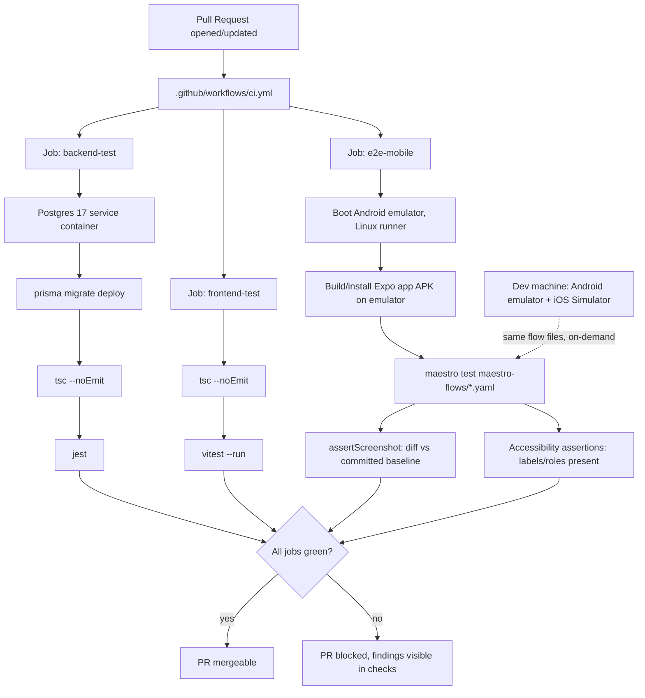

# CI, Visual Regression & Accessibility Gates - Plan

## Goal Capsule

**Objective:** Give this repo the safety net that lets AI-driven feature work land as a PR with minimal human supervision — CI gating on typecheck + tests, automated **mobile-native** visual-regression screenshots for UI changes, and automated accessibility checks — before any new feature work starts.

**Product authority:** Direct user request (2026-08-22 session), settled scoping decisions below. No upstream brainstorm/requirements doc — bootstrapped directly. Revised mid-session from an initial web/Playwright approach to mobile-native testing (Maestro) — see KTD1-KTD4.

**Open blockers:** None. Scope confirmed interactively.

---

## Problem Frame

This is a mobile app (iOS/Android via Expo) — not a web app with a browser secondary. All UI testing must reflect the actual mobile environment, not a browser simulation of it. The repo has real logic-test infrastructure (backend Jest, frontend Vitest) but nothing enforces it — there is no CI, so drift accumulates silently. UI verification today is manual and disposable: one-off Playwright browser scripts written per change, run once, judged by eye, never saved — and Playwright can only drive browsers, not native iOS/Android apps, so it was never the right tool for this app's actual UI regardless. There is also a partially-scaffolded mobile E2E tool already in the repo (`maestro.yaml` + `maestro-flows/`, 8 flows) that has never been verified to run or wired into anything.

This plan builds the missing gate layer — mobile-native this time — so a future request → plan → implement → PR loop can run without a human in the loop until PR review.

---

## Requirements

- **R1.** Every PR is blocked from merging if backend `tsc --noEmit`, backend Jest suite, or frontend `tsc --noEmit` + Vitest suite fails.
- **R2.** Backend tests run against a real Postgres instance in CI (matching local `docker-compose.yml` shape), not mocked at the DB layer.
- **R3.** UI changes get an automated visual-regression check against the actual native mobile app (Android in CI; Android + iOS locally once Xcode is installed), not a browser simulation.
- **R4.** UI changes get an automated accessibility check (screen-reader-visible labels/roles on key screens) that fails on missing/incorrect accessibility attributes.
- **R5.** The visual regression and accessibility checks run as part of the same CI gate as R1, not as a separate manual step, for the Android platform. iOS runs the same flows locally/on-demand until iOS CI is added later.
- **R6.** `ROADMAP.md`'s Phase 4 framing ("top usability blocker... fix before anything else") is corrected — email verification was resolved 2026-08-16 (commit `421c575`) and is no longer a live blocker on the default `REQUIRE_EMAIL_VERIFICATION=false` deployment.

---

## Key Technical Decisions

- **KTD1 (session-settled: user-directed — chosen over the original Playwright/web approach: this is a mobile app, not a web app with browser as primary; testing must reflect the real native environment, not a browser simulation of it):** All UI testing (visual regression + accessibility) targets native iOS/Android via **Maestro**, not a browser. This reverses the plan's original Playwright-based approach entirely for UI testing; Playwright is dropped from this plan.
- **KTD2 (session-settled: user-approved — chosen over Mobilewright, a newer Playwright-inspired native-mobile tool from Mobile Next HQ, verified real but with no track record in this repo or broadly):** Use **Maestro** specifically, not Mobilewright. Maestro already has a foothold in this repo (`maestro.yaml` + `maestro-flows/`, unwired but present) and has a proven multi-year track record; Maestro's `assertScreenshot` command (added March 2026) provides the visual-diffing capability this plan needs, at the cost of being a newer feature than Playwright's equivalent.
- **KTD3 (session-settled: user-approved — chosen over running iOS in CI from day one: iOS CI requires GitHub's macOS runners at ~10x the per-minute cost of Linux runners (~$0.06/min vs ~$0.006/min), a real recurring cost before the app is shipping to iOS):** CI (GitHub Actions) runs Maestro flows against an **Android emulator only**, on Linux runners. iOS testing happens locally (dev machine, on-demand) via Xcode's iOS Simulator, not in CI, until the project is closer to an actual iOS release — at which point adding an iOS CI job is a small, isolated addition to the same workflow file.
- **KTD4 (rationale: verified no full Xcode / iOS Simulator is currently installed on this dev machine — only Command Line Tools):** Xcode installation (needed for local iOS Simulator testing) is deferred to whichever implementation unit first needs it, not done during planning. Noted here so it isn't lost.
- **KTD5 (session-settled: user-approved — chosen over Axe DevTools for Mobile, a paid SaaS accessibility scanner with no free tier or open-source equivalent for native mobile):** Accessibility checking is **manual Maestro flow assertions** — hand-written per-screen checks that required accessibility labels/roles are present and correctly exposed to the OS accessibility layer (VoiceOver/TalkBack), not a broad automated WCAG scan. This is the honest ceiling of what's achievable for free on native mobile today; broader automated scanning is a future paid-tool addition if compliance needs grow.
- **KTD6 (rationale: matches current repo convention — no separate `frontend`/`backend` sub-workflows exist; the one existing workflow lives at repo root):** One new workflow file, `.github/workflows/ci.yml`, with three jobs (`backend-test`, `frontend-test`, `e2e-mobile`) rather than three separate workflow files.
- **KTD7 (rationale: matches the one existing CI workflow's pinned version, avoids introducing a second Node version to reconcile):** Pin CI to Node 20, matching `.github/workflows/eas-build.yml`'s existing pin.

---

## High-Level Technical Design

---

## Implementation Units

### U1. Backend CI job: typecheck + Jest against real Postgres

**Goal:** Gate PRs on backend correctness with a real database, not mocks.

**Requirements:** R1, R2

**Dependencies:** None

**Files:**
- `.github/workflows/ci.yml` (new)

**Approach:** New `backend-test` job. Postgres 17 service container mirroring `docker-compose.yml`'s shape (health-checked via `pg_isready`). Steps: checkout → `actions/setup-node@v4` (Node 20, npm cache keyed to `backend/package-lock.json`) → `npm ci` in `backend/` → `npx prisma migrate deploy` against the service container's `DATABASE_URL` → `npx tsc --noEmit` → `npm test`. Use ephemeral CI-only credentials for the service container (not the dev-only `admin`/`admin123` pair from `docker-compose.yml`) and inject `JWT_SECRET`, `NODE_ENV=test`, and any other var `backend/src/__tests__/setup.ts` requires as job-level env, not as GitHub secrets.

**Patterns to follow:** `.github/workflows/eas-build.yml`'s existing structure (checkout → setup-node with npm cache → install → typecheck → test) for step ordering and style consistency.

**Test scenarios:**
- Happy path: a PR with passing backend tests and clean `tsc` shows the job green.
- Failure path: deliberate `tsc` type error fails the job with real compiler output in the log.
- Failure path: deliberate failing Jest test fails the job with the specific test name in the log.
- Integration: a test that actually hits Postgres (not just mocked Prisma) passes against the service container — proves R2, not just job wiring.

**Verification:** Push a branch with this workflow; open a throwaway PR; confirm `backend-test` appears and passes on clean code, fails on each scenario above when deliberately broken.

---

### U2. Frontend CI job: typecheck + Vitest

**Goal:** Gate PRs on frontend correctness.

**Requirements:** R1

**Dependencies:** None

**Files:**
- `.github/workflows/ci.yml` (same file as U1, additional job)

**Approach:** New `frontend-test` job, parallel to `backend-test`. Steps: checkout → `actions/setup-node@v4` (Node 20, npm cache keyed to `frontend/package-lock.json`) → `npm install --legacy-peer-deps` in `frontend/` (matches `eas-build.yml`'s existing install flag) → `npx tsc --noEmit` → `npm test -- --run`.

**Patterns to follow:** Directly mirrors the typecheck+test steps already proven working in `eas-build.yml`.

**Test scenarios:**
- Happy path: clean frontend code passes the job.
- Failure path: deliberate `tsc` error in a `.tsx` file fails the job with real error output.
- Failure path: deliberate failing Vitest test fails the job with the test name visible.

**Verification:** Same throwaway PR as U1; confirm `frontend-test` behaves correctly on pass/fail cases.

---

### U3. Verify and repair the existing Maestro setup

**Goal:** The repo already has `maestro.yaml` + `maestro-flows/` (8 flows) that ROADMAP flags as "never confirmed to actually run." Before building on top of it, confirm it actually works, fixing whatever's broken.

**Requirements:** R3, R4 (prerequisite)

**Dependencies:** None

**Files:**
- `maestro.yaml` (verify/fix)
- `maestro-flows/*.yaml` (verify/fix, existing 8 flows)

**Approach:** Install the Maestro CLI locally (`curl -Ls "https://get.maestro.mobile.dev" | bash`, free). Start an Android emulator locally (via Android Studio's AVD manager — needed for Expo development anyway, so likely already available or a one-time setup). Run each of the 8 existing flows against a locally-running Expo dev build on that emulator; fix any that fail due to drift (the flows were written 2026-05-20 per ROADMAP and the app has changed since — expect some breakage). Note: `mcp-database-server/` (read-only Postgres query tool) is paired with these flows for DB-state verification per ROADMAP — confirm whether it's still needed and wire it in only if a flow actually depends on it.

**Execution note:** This unit is diagnostic-first — the actual scope of "what's broken" isn't knowable until the flows are run once. Budget for fixing drift, not just confirming it exists.

**Test scenarios:**
- `Test expectation: none -- this unit repairs existing test infrastructure; its own correctness is proven by U3's Verification below (the flows themselves passing), not a separate test suite.`

**Verification:** All 8 existing flows in `maestro-flows/` run to completion against a local Android emulator without error. Document (in this plan's own follow-up notes or a short doc/solutions entry) what was broken and fixed.

---

### U4. Visual-regression baselines via Maestro `assertScreenshot`

**Goal:** Catch UI regressions on native mobile automatically, not by eyeballing.

**Requirements:** R3

**Dependencies:** U3

**Files:**
- `maestro-flows/visual/*.yaml` (new — visual-regression-specific flows, separate from the existing functional flows in U3)
- `maestro-flows/visual/.screenshots/` (new, committed baseline images)

**Approach:** Write new Maestro flows (or extend relevant existing ones from U3) using `assertScreenshot` at key points in at least 3 screens: login/signup, group list, expense list (highest-traffic screens per `ROADMAP.md`'s "stable and working end-to-end" list — same screens originally planned for the web version). Default 95% pixel-match threshold per Maestro's built-in behavior; adjust per-assertion only where a screen has legitimately dynamic content. Generate baselines once locally against the Android emulator, review them, commit them. Document that baselines must be regenerated on the same emulator API level/device profile used in CI (Android emulator screenshots can differ subtly across device configurations — mirror KTD3's Android-only CI scope, so only one baseline set is needed for now).

**Execution note:** Generate and commit baselines as the last step, only after flows are reviewed — a baseline committed before the flow is right just bakes in whatever rendered first.

**Test scenarios:**
- Happy path: unchanged UI → flow passes with no screenshot diff flagged.
- Regression: deliberately change a screen's padding/color → confirm the flow fails and Maestro reports the mismatch.
- Edge case: a screen with dynamic content (e.g., a timestamp) doesn't produce false-positive failures — mask or exclude that region if `assertScreenshot` supports cropping to a sub-region (per research: it does).

**Verification:** Run the new visual flows locally against a clean emulator boot — pass on first baseline commit; deliberately introduce a visual change, confirm failure; revert, confirm pass again.

---

### U5. Accessibility assertions via Maestro flows

**Goal:** Catch missing/incorrect screen-reader accessibility on key screens — the closest free equivalent to an automated a11y scan available for native mobile today.

**Requirements:** R4

**Dependencies:** U3

**Files:**
- `maestro-flows/visual/*.yaml` (extend — same files as U4, add accessibility assertions to the same flows rather than duplicating navigation steps)

**Approach:** For each of the 3 screens covered in U4, add Maestro assertions that check the accessibility-layer-visible label/role for key interactive elements (buttons, inputs, nav items) actually exists and is meaningful — not empty, not a raw testID leaking through. This directly exercises what TalkBack/VoiceOver would announce, since Maestro interacts through the OS accessibility layer rather than app internals (per KTD5 — this is manual, hand-written per screen, not a broad automated scan).

**Test scenarios:**
- Happy path: current key interactive elements on the 3 covered screens have correct accessibility labels (verify this is actually true before committing the gate — if any are missing, fix them as part of this unit).
- Regression: deliberately remove or blank an accessibility label on a button, confirm the flow assertion fails with a clear message.

**Verification:** Run the extended flows locally; confirm current screens pass; confirm a deliberately-blanked label fails.

---

### U6. Wire Maestro suite into CI as a merge gate (Android)

**Goal:** Make U3-U5 enforceable on every PR automatically, not just runnable locally.

**Requirements:** R5

**Dependencies:** U1, U2, U3, U4, U5

**Files:**
- `.github/workflows/ci.yml` (same file, third job)

**Approach:** New `e2e-mobile` job on `ubuntu-latest` (Linux — Android emulators run fine there, no macOS runner needed per KTD3). Steps: checkout → setup-node (Node 20) → install Expo/EAS deps → boot an Android emulator via `reactivecircus/android-emulator-runner` (a common, free GitHub Action for exactly this) → build/install a debug APK of the app on that emulator → install Maestro CLI → run `maestro test maestro-flows/` (covering U3's functional flows + U4/U5's visual/a11y flows). Upload Maestro's output (including any failed screenshot diffs) as a workflow artifact on failure. This job does not depend on `backend-test`/`frontend-test` passing first (runs in parallel) but all three should be required status checks for merge — configure branch protection to require all three (manual GitHub UI step, outside this plan's reach — flagged, not done, same as the original plan's note).

**Test scenarios:**
- Happy path: full PR with no UI changes → all three jobs green, mergeable.
- Regression: PR with a deliberate visual or accessibility regression → `e2e-mobile` fails, artifact downloadable from the failed check.
- Integration: confirm the emulator-boot + APK-install steps actually work in CI's environment, not just locally — this is the step most likely to behave differently in CI (emulator boot time, API level availability, resource limits on GitHub's runners).

**Verification:** Open a real throwaway PR exercising all three jobs; confirm all pass on clean code; confirm each fails independently and correctly when its specific input is broken.

---

### U7. Correct stale ROADMAP.md Phase 4 framing

**Goal:** Stop the documented backlog from misleading future planning into treating a resolved issue as the top blocker.

**Requirements:** R6

**Dependencies:** None

**Files:**
- `ROADMAP.md` (edit Phase 4 section)
- `PROJECT_MEMORY/01-MASTER_STATE.md` (edit "Known broken" line, same stale claim)

**Approach:** In `ROADMAP.md`, replace the "Priority note (2026-07-27)... top usability blocker" framing and the unchecked "web `/verify-email` route doesn't call the verify API" item with an accurate status: fixed 2026-08-16 via commit `421c575` — signup/login now correctly skip verification when `REQUIRE_EMAIL_VERIFICATION=false` (the live Render default). Note the underlying web deep-link route may still be worth revisiting later (lower priority) if `REQUIRE_EMAIL_VERIFICATION` is ever flipped to `true`. Update `01-MASTER_STATE.md`'s "Known broken" line to match.

**Test scenarios:**
- `Test expectation: none -- documentation-only change, no behavior to test.`

**Verification:** Read the updated sections; confirm accuracy against `421c575`'s actual diff and `docs/solutions/logic-errors/signup-always-shows-check-email-regardless-of-verification-flag.md`.

---

## Scope Boundaries

**In scope:** CI for backend/frontend tests + typecheck; Maestro-based mobile-native visual regression + accessibility assertions, Android in CI; the ROADMAP correction.

**Out of scope (deferred to follow-up work):**
- iOS in CI (KTD3) — cost-deferred; add as a follow-up job once closer to an iOS release. Local iOS Simulator testing (once Xcode is installed, per KTD4) remains available on-demand in the meantime.
- Broad automated accessibility scanning (a paid tool like Axe DevTools for Mobile) — KTD5 chose manual assertions instead; revisit if compliance needs grow.
- A dedicated visual-diff review UI/SaaS (Applitools Eyes) — KTD2 chose Maestro instead.
- Mobilewright — considered (KTD2) and not chosen; Maestro's existing repo foothold and maturity won out.
- Branch protection rule configuration in GitHub's UI (U6 notes this as a manual step).
- Deployment (Azure Container Apps/Static Web Apps/Postgres, ROADMAP Phase 7) — explicitly out of scope.
- Fixing any pre-existing accessibility gaps discovered but not covered by U5's 3 screens.
- E2E/visual/a11y coverage beyond the three screens named in U4/U5 — can expand incrementally once the pattern is proven.

---

## Risks & Dependencies

- **Risk: the existing 8 Maestro flows may need substantial repair (U3), not just confirmation.** They've never been run since being written 2026-05-20; the app has changed since. Budgeted for in U3's execution note.
- **Risk: Android emulator behavior in CI (`reactivecircus/android-emulator-runner`) may be slower or flakier than local.** No local pattern to de-risk this since CI has never run an emulator before — U6's own verification (confirm it actually works in CI, not just locally) is the concrete check.
- **Risk: Maestro's `assertScreenshot` is a newer feature (March 2026) with less production track record than Playwright's equivalent** (per KTD2 — accepted tradeoff for staying mobile-native and reusing the repo's existing Maestro investment).
- **Dependency: Xcode installation for local iOS testing is deferred (KTD4)** — will block local iOS verification until installed; does not block Android-focused U1-U7.
- **Dependency: branch protection (requiring all three CI jobs before merge) is a one-time manual GitHub setting**, outside this plan's reach.

---

## Verification Contract

- `backend-test`, `frontend-test`, and `e2e-mobile` jobs all defined in `.github/workflows/ci.yml` and triggered on `pull_request`.
- A throwaway PR with no changes passes all three jobs.
- Each failure mode (backend tsc, backend test, frontend tsc, frontend test, visual diff, accessibility assertion — six total) has been deliberately triggered at least once and confirmed to fail its owning job with a legible error.
- All 8 existing Maestro flows (U3) run to completion against a local Android emulator.
- The 3 new/extended visual+accessibility flows (U4/U5) pass cleanly against committed baselines on unmodified code.
- `ROADMAP.md` and `01-MASTER_STATE.md` no longer describe email verification as an active blocker.

## Definition of Done

All seven implementation units merged to `master`, CI green on the merging PR itself, and branch protection manually enabled by the user per the Risks & Dependencies note. iOS CI and Xcode installation remain explicitly deferred, not part of this Definition of Done.

---

## Sources & Research

- Repo facts: `backend/package.json`, `frontend/package.json`, `backend/jest.config.js`, `frontend/vitest.config.ts`, `.github/workflows/eas-build.yml`, `docker-compose.yml`, `backend/prisma/schema.prisma`, `backend/.env.example`, `maestro.yaml`, `ROADMAP.md` (verified via direct read/agent, 2026-08-22).
- External research (2026-08-22): GitHub Actions matrix/service-container patterns for Node/Postgres CI. Maestro's `assertScreenshot` capability (added March 2026), accessibility-layer interaction model, and lack of automated WCAG scanning. Mobilewright verified as a real but unofficial Mobile Next HQ project, not a Playwright-team product. GitHub Actions runner cost comparison (Linux ~$0.006/min vs macOS ~$0.062/min) driving the Android-first CI decision (KTD3).
- `docs/solutions/logic-errors/signup-always-shows-check-email-regardless-of-verification-flag.md` — source of truth for U7's correction.
- `PROJECT_MEMORY/01-MASTER_STATE.md`, `ROADMAP.md` — stale-content targets for U7.
