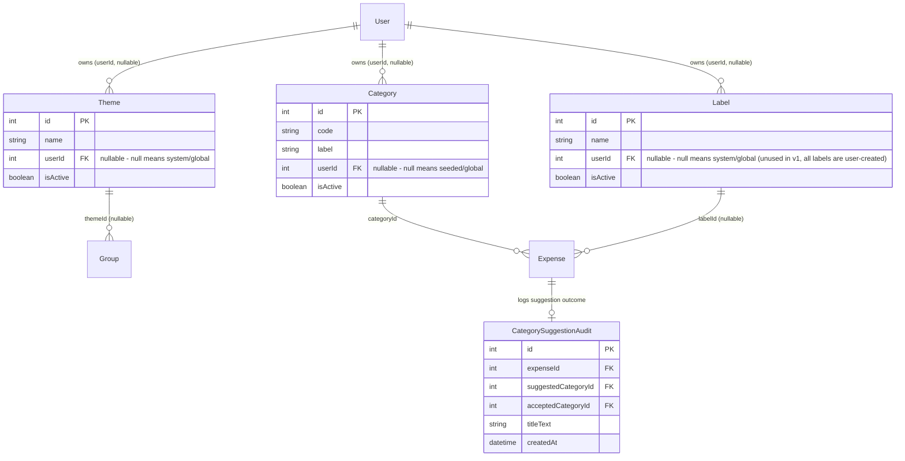
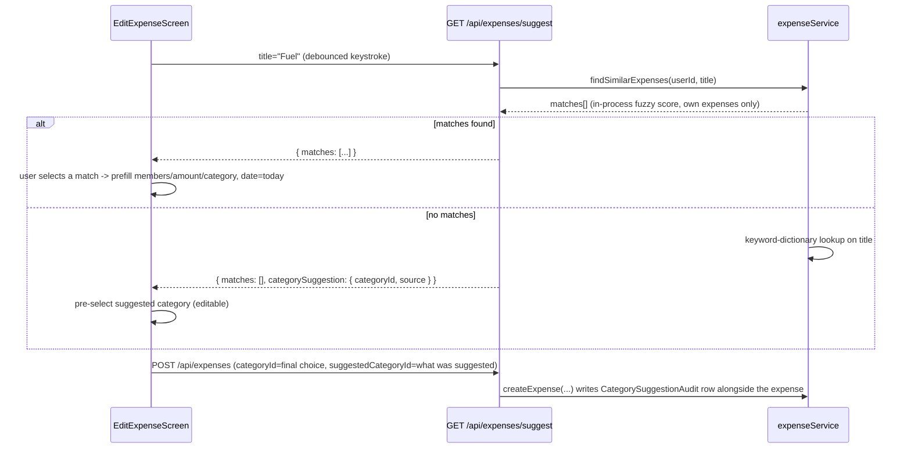

# Intelligence Layer: Themes, Labels, Category Auto-Suggestion & Expense Autocomplete - Plan

## Goal Capsule

**Objective:** Lay the foundational "intelligence layer" infrastructure (recurring group linkage via Themes, free-text cross-group Labels, extensible Categories, and expense-entry autocomplete/auto-suggestion) that later user-facing features — a settlement/KPI dashboard, natural-language expense Q&A (Phase 8), scheduled recurring-expense generation — will build on. This plan intentionally ships infra before UI: it exists because the user's actual monthly workflow (a new `Group` per month, no linkage between them, full manual re-entry of recurring expenses) has no structural support today, and building the flashier consumer-facing views first would mean rebuilding them once the underlying data model changes.

**Product authority:** Solo-developer personal project (Navin), not a multi-stakeholder product decision. Requirements below are the distilled result of an extended `/ce-brainstorm` dialogue that explored and explicitly rejected several larger/adjacent directions (see Out of Scope).

**Open blockers:** None — dialogue reached full convergence, all decision points below are session-settled.

---

## Product Contract

### Requirements

- **R1 — Theme (Group-level, reusable).** `Group` gains a new, optional, editable field: `theme`. When creating or editing a group, the user picks an existing theme or creates a new one via the same dropdown (see R7 for the shared dropdown UX). A theme is shared master data — editing its name updates it everywhere it's referenced; disabling it (not hard-deleting) removes it from the create/edit dropdown for new selections while groups that already reference it keep working normally. Themes exist to link groups across time (e.g. "Monthly Expense" reused every month) as the foundation for future cross-group aggregation — no aggregation UI is built in this plan (see Out of Scope).

- **R2 — Category becomes user-extensible.** The existing fixed 7-category set (`FOOD`, `ACCOMMODATION`, `TRAVEL`, `ENTERTAINMENT`, `SHOPPING`, `UTILITIES`, `OTHER`) remains as seeded defaults, but users can now add their own custom categories via the same "Add new" dropdown pattern as R7. Custom categories are disabled rather than hard-deleted when removed, for the same reason as R1.

- **R3 — Label (new entity, free-text, cross-group, shared master data).** A new `Label` concept, distinct from both Category and Theme: a free-text, user-created tag (e.g. "Liverpool") applicable to individual expenses, reusable across any group (not scoped to a single group or theme). Like Theme and Category, a Label is shared master data (id + editable name) — editing the name propagates everywhere; the same "disable, don't hard-delete" behavior applies (R6).

- **R4 — Manage Labels screen.** A standalone screen, reachable outside any specific group (e.g. from a top-level settings/menu area), listing all labels the user has created. For each label, show the total amount spent across all expenses currently carrying that label (a simple cross-group sum — not the deferred multi-chart dashboard). This screen is also where a user disables a label (R6).

- **R5 — Expense-title autocomplete.** As the user types an expense title on the create/edit-expense screen, the app fuzzy-matches against the user's own past expenses **globally** (across all groups, not scoped to the current group's theme). Presenting a match and the user selecting it prefills: members (split-with list), amount, and category from that past expense. The expense date always defaults to today regardless of the matched expense's date. Every prefilled field remains editable before the user saves — nothing is auto-submitted.

- **R6 — Shared "disable, don't hard-delete" behavior for Theme, Category, and Label.** All three master-data types use the same lifecycle rule: disabling removes the item from create/edit dropdowns for new selections, but any expense or group that already references it keeps that reference and displays it normally. This preserves historical data integrity across all three without needing per-type reference-counting/deletion-blocking logic.

- **R7 — Shared dropdown UX for Theme, Category, and Label selection.** All three selectors (on the create/edit-group screen for Theme, on the create/edit-expense screen for Category and Label) share one interaction pattern: the first option in the dropdown is always "Add new," followed by the user's existing saved values for that type; the dropdown supports type-ahead filtering (narrowing the existing-values list as the user types), the same interaction shape as R5's title autocomplete.

- **R8 — Category auto-suggestion for expense titles with no close match.** When R5's title-autocomplete finds no close match (a genuinely new title), the app attempts a category auto-suggestion via **keyword-dictionary matching** — a maintained mapping of common words (e.g. "fuel," "gas," "petrol" → Transport-equivalent category) to the category set from R2. If no keyword matches, category defaults to "Other" (or the user's last-used category — implementation detail for planning to resolve). Every suggestion made, and whether the user accepted or overrode it, is logged (new field/table — implementation detail for planning) to build a labeled dataset for a possible future graduation to a smarter mechanism (explicitly not ML/LLM-based in this plan — see Out of Scope).

### Flows

**Flow A — Creating a themed, recurring-friendly group.**
1. User taps "Create Group."
2. On the Theme field, user either selects an existing theme (e.g. "Monthly Expense," reused from last month) or picks "Add new" and types a new theme name.
3. Group is created with that theme attached, same as all other group fields work today.

**Flow B — Fast-entering a recurring expense via autocomplete.**
1. User starts a new expense within a group and starts typing the title (e.g. "Fuel").
2. As they type, the app surfaces fuzzy-matched past expenses (global search) in a suggestion list.
3. User selects a suggestion → members, amount, and category prefill from that past expense; date is today.
4. User edits amount (if it changed since last time — e.g. fuel price) and/or any other field, then saves normally.

**Flow C — Entering a genuinely new expense with no history.**
1. User types a brand-new title with no close past match (e.g. "Shell Gas Station," first time ever entering something like this).
2. No autocomplete suggestion appears (R5 doesn't fire).
3. Category auto-suggestion (R8) attempts a keyword match against the title/description; if "gas" is in the keyword dictionary mapped to a transport-like category, that category is pre-selected (still editable/overridable); otherwise defaults to "Other."
4. Whether the user accepts or changes the suggested category is logged.

**Flow D — Tagging and reviewing labeled expenses.**
1. While creating/editing an expense, user adds a Label via the shared dropdown (R7) — either picking an existing label (e.g. "Liverpool," used on a prior expense in a different group) or creating a new one.
2. Later, user opens the standalone Manage Labels screen (R4), sees "Liverpool: £340 total" summed across every group where an expense carries that label.
3. If the label was a typo or is no longer needed, the user disables it from this screen (R6) — it stops appearing in future dropdowns, but the £340 of already-labeled historical expenses keep showing "Liverpool" on them.

### Acceptance Examples

- **AE1:** Given a user has a "Monthly Expense" theme already used on 3 prior groups, when they create a new group and select "Monthly Expense" from the theme dropdown (not "Add new"), then no duplicate theme is created — the group references the existing theme record.
- **AE2:** Given a user previously entered an expense titled "Fuel" for £50, split among 2 members, categorized as the fuel-equivalent category, when they later type "Fuel" while creating a new expense and select the resulting suggestion, then the new expense form pre-populates the same 2 members and category, amount pre-fills to £50 but remains editable, and the date is today (not the date of the prior "Fuel" expense).
- **AE3:** Given the keyword dictionary maps "gas"/"fuel"/"petrol" to a transport category, when a user types a title containing "gas station" that has no close match to any past expense, then the category field pre-selects the transport category and the suggestion (and any override) is logged.
- **AE4:** Given a user has labeled 5 expenses across 3 different groups with the label "Liverpool," when they open the Manage Labels screen, then they see one "Liverpool" entry showing the sum of all 5 expenses' amounts, regardless of which group each belongs to.
- **AE5:** Given a label "Livrpool" (typo) is applied to 2 existing expenses, when the user disables it from the Manage Labels screen, then it no longer appears as a selectable option on any create/edit-expense screen, but the 2 existing expenses still display "Livrpool" as their label.

### Key Decisions

- **KTD1 — `session-settled: user-directed`.** Recurring-expense mechanism is autocomplete-and-prefill (reactive, triggered by typing), not scheduled/proactive draft-generation. Rejected alternative: a theme-scheduled background job that auto-generates a pending draft expense on a fixed date each month, requiring a new pending-expense state and a cron trigger — judged too much infrastructure for the value delivered, deferred as a possible future enhancement once the theme/autocomplete foundation is live and actual missed-entry frequency is known.
- **KTD2 — `session-settled: user-directed`.** Groups remain the unit of month-to-month organization; no persistent "Household" entity replaces or wraps them. Rejected alternative: introducing a durable household/recurring-context object that owns members and spans months, with months as sub-periods inside it — judged a much larger data-model change than the value justified right now.
- **KTD3 — `session-settled: user-directed`.** Category auto-suggestion uses keyword-dictionary matching (Splitwise's public, proven approach), not ML/NLP classification or an LLM API call. Rejected alternatives: a trained classifier (cold-start problem — no benefit until a user has significant history) and an LLM call (per-request cost, latency, and sends expense descriptions to a third party) — both deferred as possible future graduations once the logged suggestion/override data (R8) exists to justify the investment.
- **KTD4 — `session-settled: user-directed`.** Autocomplete/title-match suggestions search **globally** across all of a user's past expenses, not scoped to the current group's theme. Rejected alternative: theme-scoped-only or theme-scoped-with-global-fallback — judged unnecessary complexity for a single lookup.
- **KTD5 — `session-settled: user-directed`.** Theme, Category, and Label all share one lifecycle rule (disable, not hard-delete) and one dropdown UX (Add-new-first, type-ahead filtering on existing values) — extended by inference from the user's explicit Label-deletion answer to the other two types for interaction consistency; flagged in dialogue as an assumption, not independently probed for Theme/Category.
- **KTD6 — `session-settled: user-directed`.** Fixed KPI/settlement dashboard, scheduled recurring generation, open-ended natural-language expense Q&A, and ML/LLM-based category prediction are all explicitly out of scope for this plan (see Out of Scope) — this plan is infra-only, by explicit user redirect mid-brainstorm ("i dont want a fixed view first... first build whats more infra specific").

### Out of Scope

- **Fixed KPI/settlement dashboard** (per-person balance trends, category spend trends, settlement-status-per-month) — explored in dialogue, three concrete view candidates discussed, but the user redirected to prioritize infrastructure first. A future plan can build these views as a direct consumer of Theme (R1) and Label (R3) once this infra ships.
- **Scheduled/proactive recurring-expense generation** ("auto-draft an expense on the 31st for review") — the theme-scheduled background-job mechanism explored and rejected in favor of R5's simpler autocomplete approach (KTD1). May be revisited as a genuine future enhancement.
- **Open-ended natural-language expense Q&A** ("average Tesco spend per month," free-text queries with charts) — this is the existing Phase 8 "AI expense Q&A" roadmap item (with its own hard constraint: LLM only translates to a structured query, never computes numbers itself). Explicitly kept as its own separate future brainstorm rather than folded into this plan.
- **ML/LLM-based category prediction** — deferred per KTD3; R8's logged suggestion/override data is the explicit on-ramp for revisiting this later, not something this plan builds.

### Assumptions

- The keyword dictionary (R8) ships with a small starter set per category, informed by publicly known examples like Splitwise's approach, rather than launching empty — exact seed list is a planning-stage detail.
- "Last-used category" as an R8 fallback (vs. always defaulting to "Other") is left as an open implementation choice for planning to resolve; either is acceptable per the brainstorm dialogue.
- The Manage Labels screen's per-label total (R4) is a simple sum query, not a themed/time-bucketed breakdown — that level of detail belongs to the deferred dashboard.

## How This Work Fits Together

This plan is explicitly the first of at least three related future pieces, per the user's own framing during the brainstorm:
1. **This plan** — Theme, Label, extensible Category, autocomplete, keyword-based category suggestion (infra).
2. **Future — Settlement/KPI dashboard** — consumes Theme (and possibly Label) to show per-person balances, spend trends, and settlement status over time across linked groups. Explicitly deferred, not started.
3. **Future — Natural-language expense Q&A** (existing Phase 8 item) — consumes the same underlying data (and possibly benefits from R8's logged category signal) to answer arbitrary questions like "average Tesco spend per month." Explicitly kept separate, not started.

These relationships are tentative and may be revised, split further, or merged differently once planning for piece 1 is underway.

---

## Planning Contract

**Product Contract preservation:** unchanged from the brainstorm above, with one clarification resolved during planning (see KTD7) that the brainstorm left open rather than settled: whether Theme/Category/Label master data is global or per-user. All R/F/AE/KTD1-6 IDs are preserved as written.

**Plan depth:** Deep — new data model (3 new tables, 3 modified tables), a new reusable frontend component, a new backend search/matching capability, and a cross-cutting ownership model (KTD7) that touches every new query. Grouped into two delivery phases below.

**Research grounding:** `backend/prisma/schema.prisma`, `backend/src/services/groupService.ts`, `backend/src/services/expenseService.ts`, `backend/src/schemas/expenseSchema.ts`, `backend/src/errors/AppError.ts`, `backend/src/locales/{en,fr}/translation.json`, `frontend/src/screens/EditExpenseScreen.tsx`, `frontend/src/services/categoryService.ts`, and `docs/solutions/test-failures/prisma-mock-factory-precedence.md` / `docs/solutions/logic-errors/hydration-effect-runs-reset-after-populating-real-values.md` (read live at planning time — see Key Technical Decisions and per-unit Patterns to follow for what each grounds).

### Key Technical Decisions

- **KTD7 — Ownership model for Theme/Category/Label: nullable `userId` on each table, resolved during planning with Navin.** `userId = NULL` means system/global (visible and usable by every user — matches how the existing 7 seeded `Category` rows already work); a real `userId` means that row is a user-created custom entry, visible to every user for *selection* but only **disableable by its owner** (R6). Every list/dropdown query becomes `WHERE (userId IS NULL OR userId = :currentUserId) AND isActive = true`. Rejected alternative: fully global (matches existing `Category` precedent exactly, simplest schema) — rejected because Labels in particular are personal (e.g. "Anniversary Trip") and letting any user disable another user's custom entry would be a real authorization gap, not just a style inconsistency. Also rejected: fully per-user (each user has their own private copy, including of the 7 seeded categories) — rejected because it would require seeding categories once per user instead of once globally, a bigger migration/seed change for no clear benefit given the existing categories are meant to be shared reference data.
- **KTD8 — R8's fallback resolved to "Other," not "last-used category."** The brainstorm left this open (see Assumptions). "Last-used category" needs new per-user state (what was the last category used, scoped correctly across concurrent group activity) for a fallback case that only fires when there's *also* no autocomplete match — a rare compound condition. "Other" is already the existing default (GitHub issue #6's fix, `EditExpenseScreen.tsx`) and needs no new state. Revisit only if R8's logged suggestion data (see U6) shows "Other" firing often enough to be annoying.
- **KTD9 — Autocomplete fuzzy matching runs in-process (token-overlap + substring scoring in TypeScript), not a new dependency or DB extension.** Alternatives considered: `fuse.js` (a well-known npm fuzzy-search library) — rejected for v1 to avoid a new supply-chain dependency (CLAUDE.md's OWASP A03 audit requirement) for a personal-scale app where one user's total expense count is expected to stay in the hundreds, not millions; Postgres `pg_trgm` — rejected to avoid a new DB extension and migration-environment dependency for the same reason. Revisit either if U5's verification shows in-process scoring is too slow or too poor a match quality once real usage data exists.
- **KTD10 — Category-suggestion audit logging piggybacks on expense creation, not a separate network round trip.** `createExpense`'s payload gains an optional `suggestedCategoryId` field (what the client's keyword-dictionary lookup suggested, if any, before the user's final choice). `expenseService.createExpense` writes a `CategorySuggestionAudit` row in the same transaction when `suggestedCategoryId` is present, comparing it to the actually-saved `categoryId`. Rejected alternative: a separate `POST .../category-suggestion-outcome` call fired independently of save — rejected because it adds a network round trip and a way for the log to desync from what was actually saved (e.g. if the user abandons the form after the suggestion fires but before saving).
- **KTD11 — Label is single-select per expense (one nullable `labelId` FK on `Expense`), not a multi-label many-to-many join.** The brainstorm's R7 groups Label's dropdown UX with Category's (both single-select dropdowns on the expense screen) and no flow or acceptance example shows an expense with more than one label. Keeps the schema, dropdown, and Manage Labels total-spend query identical in shape to Category. If multi-label per expense is wanted later, it's an additive schema change (join table), not a rework of this plan's foundations.
- **KTD12 — clarification, not a scope change: R7's "same interaction shape as R5's title autocomplete" means the type-ahead filtering behavior only, not a shared visual container.** Found during review — U9 deliberately builds an inline, non-modal suggestion list for R5 (distinct from R7's modal dropdown), which a literal reading of R7 could be misread to contradict. Both requirements are correct as written; this KTD just names which reading is intended so U7 and U9 aren't built to force a shared component they were never meant to share.

### Scope Boundaries

**In scope:** Theme (group-level), user-extensible Category, Label (expense-level) + Manage Labels screen, expense-title autocomplete with prefill, keyword-dictionary category auto-suggestion with outcome logging, the shared Add-new/type-ahead dropdown component, and the ownership model in KTD7.

**Out of scope (unchanged from brainstorm):** see the Product Contract's "Out of Scope" above (dashboard, scheduled recurring generation, NL Q&A, ML/LLM category prediction).

**Deferred to Follow-Up Work (surfaced during planning, not in the original brainstorm):**
- Multi-label-per-expense (KTD11) — additive schema change if ever needed.
- A UI for a user to re-enable a disabled Theme/Category/Label they own — R6 only requires disabling; re-enabling isn't in any flow or acceptance example. Noting it because its absence means a disable is currently a one-way action from the UI (though reversible directly in the DB).
- Backfilling `CategorySuggestionAudit` analysis/reporting — U6 only writes the log; nothing in this plan reads or visualizes it (that's explicitly the future ML/LLM graduation's job, per KTD3).

### Open Questions

None blocking — KTD7 and KTD8 resolve the brainstorm's two open items. One non-blocking implementation-time question is deferred explicitly: the exact starter keyword-dictionary word list (U6) is left to the implementer to draft from common expense-title vocabulary (Splitwise's public category-keyword approach is the model per KTD3), reviewed in code review rather than pre-specified here — the dictionary is data, not a design decision, and is trivially editable post-launch.

---

## High-Level Technical Design

Every new FK follows the schema's existing `xxxId Int(?)` + `relation` shape — the same idiom already used for `Expense.categoryId`/`Group.currencyId` (both **required**, `Int` not `Int?`), just applied here to **nullable** relations (`Theme.userId`, `Category.userId`, `Label.userId`, `Group.themeId`, `Expense.labelId`) since ownership and Theme/Label associations are all optional. No new schema idiom is introduced — only the nullability differs from the existing required-FK examples, and Prisma expresses that the same way it already does elsewhere in this schema (`?` suffix on both the scalar field and the relation). The dotted "owns" relations in the ERD are all nullable exactly the same way, which is what makes KTD7's `WHERE userId IS NULL OR userId = :currentUserId` query shape uniform across all three tables.

**Request flow for autocomplete + category suggestion (R5, R8):**

---

## Implementation Units

### Phase A — Backend Infrastructure

### U1. Schema: Theme, Label, CategorySuggestionAudit tables + ownership/disable fields on existing tables

**Goal:** Land the full data-model foundation (KTD7, KTD11) in one migration so every later unit builds on a stable schema.

**Requirements:** R1, R2, R3, R6, R8, KTD7, KTD11

**Dependencies:** None

**Files:**
- `backend/prisma/schema.prisma` (add `Theme`, `Label`, `CategorySuggestionAudit` models; add `userId Int?` + `isActive Boolean @default(true)` to `Category`; add `themeId Int?` + `theme Theme?` to `Group`; add `labelId Int?` + `label Label?` to `Expense`)
- `backend/prisma/migrations/<timestamp>_add_intelligence_layer_tables/migration.sql` (generated via `npx prisma migrate dev`, not hand-written)
- `backend/prisma/seed.ts` (verify existing 7-category seed still runs with `userId` left `NULL` — no seed content change needed, just confirm the new nullable column doesn't break the existing seed script)

**Approach:** Mirror the existing `Expense.categoryId`/`category` FK-plus-relation shape exactly, applied to nullable fields this time (see High-Level Technical Design's note on required-vs-nullable FKs). `Theme` and `Label` both get `{ id, name, userId Int?, isActive Boolean @default(true), createdAt }` plus a `user User? @relation(...)`. `CategorySuggestionAudit` gets `{ id, expenseId, suggestedCategoryId, acceptedCategoryId, titleText, createdAt }` with a relation to `Expense` using **`onDelete: Cascade`** on `expenseId` — deliberately different from the "safest default" instinct of `SetNull`, because `titleText` is a copy of a real expense title (potentially sensitive free text) and `deleteExpense` already exists and is user-reachable; `SetNull` would leave that copied text orphaned and undeletable by the user once its source expense is gone, while `Cascade` means deleting an expense also deletes its own suggestion-audit row, closing that gap (found during review — see Risks & Dependencies). Add `@@index([userId])` to `Theme`/`Category`/`Label` and `@@index([labelId])`/`@@index([themeId])` to `Expense`/`Group`, mirroring the existing index style at the end of each model block.

**Patterns to follow:** `backend/prisma/schema.prisma` lines 79-96 (`Group`'s `isActive`/`currencyId` shape) and lines 99-125 (`Expense`'s `categoryId` shape) — copy these exactly, don't invent a new relation style.

**Test scenarios:**
`Test expectation: none -- pure schema/migration change, no application logic yet. Verified by running the migration against a local Postgres instance and confirming backend/src/services/__tests__/*.test.ts (existing suite) still passes unmodified against the new schema (new nullable columns must not break any existing query or mock).`

**Verification:** `npx prisma migrate dev` runs clean against local Postgres; `npx prisma generate` succeeds; existing backend Jest suite passes unmodified; `npx tsc --noEmit` clean in `backend/`.

---

### U2. Backend: Category extensibility (custom category CRUD)

**Goal:** Let a user add their own categories on top of the 7 seeded ones, and disable (not delete) their own custom categories.

**Requirements:** R2, R6, KTD7

**Dependencies:** U1

**Files:**
- `backend/src/services/categoryService.ts` (new file — `listCategories(userId)`, `createCategory(userId, label)`, `disableCategory(userId, categoryId)`)
- `backend/src/controllers/categoryController.ts` (replace the existing minimal controller's create/list handlers to call the new service instead of raw Prisma; keep existing GET-all behavior working for callers that don't need ownership filtering, e.g. seed-time internal use)
- `backend/src/routes/categoryRoutes.ts` (**add `authMiddleware` to both routes** — verified during planning: this route file currently has no auth middleware at all, unlike every other route file in the repo (`groupRoutes.ts`, `expenseRoutes.ts`), and every U2 operation needs `req.user.id` for KTD7's ownership filter. Without this, `req.user` is `undefined` and the controller crashes on the first call. Mirror `groupRoutes.ts`'s `router.get('/', authMiddleware, ...)` shape.)
- `backend/src/schemas/categorySchema.ts` (new file — Zod: `createCategorySchema { label: z.string().min(1).max(50) }`)
- `backend/src/locales/en/translation.json`, `backend/src/locales/fr/translation.json` (add `CATEGORY.LABEL_REQUIRED`, `CATEGORY.ALREADY_DISABLED`, `CATEGORY.NOT_OWNER` keys, both locales)
- `backend/src/services/__tests__/categoryService.test.ts` (new)

**Approach:** `listCategories(userId)` queries `WHERE (userId IS NULL OR userId = :userId) AND isActive = true`, generating a unique `code` server-side from the label (slugify + uniqueness check, since `code` is `@unique` — e.g. `"Book Club"` → `CUSTOM_BOOK_CLUB`, retry-suffix on collision) so the frontend never has to supply one. `disableCategory` throws `AppError('CATEGORY.NOT_OWNER', 403, ...)` if `category.userId !== userId` (including when `userId` is `NULL` — system categories are never user-disableable in this plan, per Scope Boundaries). Do **not** mirror the existing `categoryController.ts`'s raw-Prisma, no-`AppError` pattern the research flagged as the weakest in the repo — follow `groupService.ts`'s `AppError`/Zod/i18n-key shape instead.

**Patterns to follow:** `backend/src/services/groupService.ts` (`AppError` usage, `deactivateGroup`'s `isActive: false` update shape at line 759) and `backend/src/schemas/groupSchema.ts` (Zod schema + `type X = z.infer<...>` export shape).

**Test scenarios:**
- Happy path: `listCategories` returns the 7 seeded (userId null) + a user's own custom categories, excludes another user's custom categories, excludes disabled ones.
- Happy path: `createCategory` generates a unique slugified `code`, persists with the calling user's `userId`.
- Edge case: creating a category whose slugified code collides with an existing one gets a disambiguating suffix, not a unique-constraint DB error.
- Error path: `disableCategory` on a category owned by a different user throws `AppError('CATEGORY.NOT_OWNER', 403, ...)`.
- Error path: `disableCategory` on a system category (`userId === null`) throws the same `NOT_OWNER`-shaped error.
- Error path: `disableCategory` on an already-disabled category throws `AppError('CATEGORY.ALREADY_DISABLED', 409, ...)`, not a silent no-op.
- Error path: an unauthenticated request to `POST /api/categories` or `GET /api/categories` (no valid JWT) is rejected by `authMiddleware` with 401, never reaching the controller — a route-level integration test, since `categoryRoutes.ts` currently has no auth middleware at all (pre-existing gap, fixed as part of this unit; see Risks & Dependencies).
- Covers AE-equivalent: creating a category with an empty/whitespace-only label is rejected by the Zod schema before reaching the service (400, not a DB constraint violation).

**Verification:** `npm test` (backend) green including the new suite; `npx tsc --noEmit` clean.

---

### U3. Backend: Theme CRUD

**Goal:** Let a user create/reuse/disable Themes on groups (R1).

**Requirements:** R1, R6, R7, KTD7

**Dependencies:** U1

**Files:**
- `backend/src/services/themeService.ts` (new — `listThemes(userId)`, `createTheme(userId, name)`, `disableTheme(userId, themeId)`, `renameTheme(userId, themeId, name)`)
- `backend/src/controllers/themeController.ts` (new)
- `backend/src/routes/themeRoutes.ts` (new — register under `/api/themes`, auth-protected like existing group/expense routes)
- `backend/src/schemas/themeSchema.ts` (new — Zod: `{ name: z.string().min(1).max(50) }`)
- `backend/src/services/groupService.ts` (extend `createGroup`/`updateGroup` to accept an optional `themeId`, validating it resolves to a theme the user can see per KTD7's visibility rule — reuse, don't duplicate, the `WHERE userId IS NULL OR userId = :userId` check)
- `backend/src/locales/en/translation.json`, `backend/src/locales/fr/translation.json` (add `THEME.*` keys mirroring `CATEGORY.*` from U2)
- `backend/src/services/__tests__/themeService.test.ts` (new)
- `backend/src/services/__tests__/groupService.test.ts` (extend — new `themeId` cases)

**Approach:** Structurally identical to U2's Category service (same ownership/visibility/disable rules), applied to a genuinely new entity rather than an existing one. `renameTheme` (R1: "editing its name updates it everywhere it's referenced") is a plain update — no propagation logic needed since every `Group.themeId` FK just points at the same row.

**Patterns to follow:** U2's `categoryService.ts` (once written) is now the canonical in-repo pattern for this ownership model — mirror it rather than re-deriving from `groupService.ts` directly.

**Test scenarios:**
- Happy path: create, list (own + global), rename a theme the user owns.
- Happy path: `groupService.createGroup` with a valid, visible `themeId` persists the association; `AE1` — reusing an existing theme across multiple group creations never creates a duplicate theme row.
- Error path: `renameTheme`/`disableTheme` on a theme owned by another user throws `AppError('THEME.NOT_OWNER', 403, ...)`.
- Error path: `createGroup`/`updateGroup` with a `themeId` that doesn't exist, or exists but isn't visible to the user (belongs to someone else), throws `AppError('THEME.NOT_FOUND', 404, ...)` — mirrors the existing `GROUP.CURRENCY_NOT_FOUND` pattern at `groupService.ts:100`.
- Integration: disabling a theme still leaves existing groups' `themeId` intact and `getGroup`/`getGroups` continue returning the theme's name for display (R6).

**Verification:** `npm test` (backend) green; `npx tsc --noEmit` clean.

---

### U4. Backend: Label CRUD + per-label spend total

**Goal:** Let a user create/reuse/disable Labels on expenses, and support the Manage Labels screen's per-label total (R3, R4).

**Requirements:** R3, R4, R6, R7, KTD7, KTD11

**Dependencies:** U1

**Files:**
- `backend/src/services/labelService.ts` (new — `listLabels(userId)`, `createLabel(userId, name)`, `disableLabel(userId, labelId)`, `getLabelTotals(userId)`)
- `backend/src/controllers/labelController.ts` (new)
- `backend/src/routes/labelRoutes.ts` (new — register under `/api/labels`, auth-protected like existing group/expense routes — `getLabelTotals` returns financial data, so this must not repeat the pre-existing unauthenticated-route gap found and fixed in U2)
- `backend/src/schemas/labelSchema.ts` (new)
- `backend/src/services/expenseService.ts` (extend `createExpense`/`updateExpense` to accept optional `labelId`, validated the same way as U3's `themeId` on groups)
- `backend/src/locales/en/translation.json`, `backend/src/locales/fr/translation.json` (add `LABEL.*` keys)
- `backend/src/services/__tests__/labelService.test.ts` (new)
- `backend/src/services/__tests__/expenseService.test.ts` (extend — new `labelId` cases)

**Approach:** `getLabelTotals(userId)` groups the user's own labels (visible per KTD7) with a `SUM(expense.amount)` across every expense carrying that label, scoped to expenses in groups the user is a member of — reuse `expenseService`'s existing `isMember || isCreator` group-visibility check (see research: `expenseService.ts:35-38` pattern) so a label's total never leaks amounts from a group the requesting user can't see. This directly implements **AE4**.

**Patterns to follow:** `expenseService.ts`'s `isMember`/`isCreator` authorization check (lines 35-38, 292-295, repeated at every read) — the label-totals query must apply the same group-visibility filter, not just an ownership-of-label filter, since the label itself is visible app-wide but the *expenses* under it are still group-scoped private data.

**Test scenarios:**
- Happy path: `getLabelTotals` sums correctly across 3 different groups for one label — **Covers AE4**.
- Happy path: create, list, rename... disable a label (R6) — **Covers AE5** (disabled label disappears from create/edit dropdowns via `listLabels`, but `getExpenseById`/`getGroupExpenses` on an already-labeled expense still returns and displays the label's name).
- Edge case: `getLabelTotals` for a label the user owns but that is applied to zero expenses returns a `0` total, not an error or omitted row.
- Error path: `getLabelTotals` never includes amounts from expenses in a group the requesting user isn't a member of, even if another of their own labels happens to also be used there by someone else with access (labels are visible app-wide; expense amounts are not).
- Error path: `disableLabel` on a label owned by another user throws `AppError('LABEL.NOT_OWNER', 403, ...)`.
- Integration: `createExpense`/`updateExpense` with an invalid/invisible `labelId` throws `AppError('LABEL.NOT_FOUND', 404, ...)`, same shape as U3's theme validation.

**Verification:** `npm test` (backend) green; `npx tsc --noEmit` clean.

---

### U5. Backend: Expense-title autocomplete search

**Goal:** Fuzzy-match a typed expense title against the user's own past expenses, globally (R5, KTD4, KTD9).

**Requirements:** R5, KTD4, KTD9

**Dependencies:** U1 (schema stable; does not depend on U2-U4)

**Files:**
- `backend/src/services/expenseService.ts` (extend — new `findSimilarExpenses(userId, titleQuery)`)
- `backend/src/lib/fuzzyMatch.ts` (new — pure function: token-overlap + substring scoring, no framework/DB dependency, unit-testable in isolation)
- `backend/src/controllers/expenseController.ts` (extend — new `GET /api/expenses/suggest?title=` handler)
- `backend/src/routes/expenseRoutes.ts` (extend — register the new route)
- `backend/src/schemas/expenseSchema.ts` (extend — `suggestQuerySchema { title: z.string().min(1).max(200) }`)
- `backend/src/lib/__tests__/fuzzyMatch.test.ts` (new)
- `backend/src/services/__tests__/expenseService.test.ts` (extend — `findSimilarExpenses` cases)

**Approach:** `findSimilarExpenses` scopes to expenses where the user `isMember || isCreator` of the owning group (reuse the same authorization pattern as U4), across **all** of that user's groups (KTD4 — global, not theme-scoped), returns the top N (e.g. 5) ranked by `fuzzyMatch.ts`'s score, each with the prefill payload (`splitWith` members, `amount`, `categoryId`) per **AE2**. `fuzzyMatch.ts` is deliberately framework-free (KTD9) so it can be tested as pure input→score logic without any Prisma mocking.

**Patterns to follow:** `expenseService.ts`'s existing `isMember`/`isCreator` check; `docs/solutions/test-failures/prisma-mock-factory-precedence.md` — read before writing the Prisma-mocked half of the new service test.

**Test scenarios:**
- Happy path (`fuzzyMatch.ts`, no mocking needed): `"Fuel"` scores higher against a past `"Fuel"` title than against `"Furniture"`; exact match scores highest.
- Edge case (`fuzzyMatch.ts`): empty query string, single-character query, and a query with no token overlap at all against any candidate all resolve to an empty/zero-score result, not a crash.
- Happy path (`expenseService`): `findSimilarExpenses` returns a past expense from a *different* group than the one currently being edited — **Covers AE2** (global search, not group/theme-scoped).
- Error path: `findSimilarExpenses` never returns an expense from a group the requesting user isn't a member of, even one with a textually identical title.
- Integration: the returned prefill payload's `amount`/`categoryId`/`splitWith` match the source expense exactly, and no `expenseDate` field is included in the payload (the frontend always defaults date to today per R5 — the backend should not tempt a shortcut by supplying the old date).

**Verification:** `npm test` (backend) green; `npx tsc --noEmit` clean.

---

### U6. Backend: Keyword-dictionary category auto-suggestion + outcome logging

**Goal:** When U5 finds no match, suggest a category via keyword dictionary and log the suggestion/override outcome (R8, KTD3, KTD8, KTD10).

**Requirements:** R8, KTD3, KTD8, KTD10

**Dependencies:** U1, U2 (needs the category ownership/visibility model), U5 (the "no match" trigger condition)

**Files:**
- `backend/src/lib/categoryKeywordDictionary.ts` (new — a plain `Record<string, string[]>` mapping category codes to keyword arrays, seeded with a small starter set per KTD3/Open Questions; pure data + a `suggestCategoryCode(title): string | null` lookup function)
- `backend/src/services/expenseService.ts` (extend — `GET /api/expenses/suggest`'s handler calls the dictionary lookup only when `findSimilarExpenses` returned zero matches, per the sequence diagram; `createExpense` extended to accept optional `suggestedCategoryId` and write a `CategorySuggestionAudit` row)
- `backend/src/schemas/expenseSchema.ts` (extend `createExpenseSchema` with optional `suggestedCategoryId: z.number().int().positive().optional()`)
- `backend/src/lib/__tests__/categoryKeywordDictionary.test.ts` (new)
- `backend/src/services/__tests__/expenseService.test.ts` (extend — audit-logging cases)

**Approach:** `suggestCategoryCode` does simple case-insensitive whole-word matching against the dictionary (no fuzzy scoring needed here — keyword matching is exact-word, unlike U5's title fuzzy-match), falling back to `null` when nothing matches (frontend/controller then falls back to "Other" per KTD8). `createExpense`'s audit write happens inside the same Prisma flow as the expense creation itself (KTD10) — same transaction if `createExpense` already uses one, otherwise a sequential write immediately after (check current `createExpense` implementation for transaction usage before deciding; if none exists, do not introduce a new transaction wrapper solely for the audit write — a best-effort sequential write is acceptable since the audit log is non-critical historical data, not a source of truth).

**Patterns to follow:** `backend/src/schemas/expenseSchema.ts`'s existing `createExpenseSchema` shape for adding the new optional field; `docs/solutions/logic-errors/equal-and-percentage-split-rounding-does-not-sum-to-total.md` is not directly relevant here but confirms the project's existing convention of validating numeric fields at the Zod boundary, which `suggestedCategoryId` should follow.

**Test scenarios:**
- Happy path (`categoryKeywordDictionary`): a title containing `"gas station"` resolves to the transport-equivalent category code — **Covers AE3**.
- Edge case (`categoryKeywordDictionary`): a title with no dictionary keyword returns `null`, not a throw or a default guess baked into the dictionary function itself (KTD8's "Other" fallback is the *caller's* responsibility, not the dictionary's).
- Edge case (`categoryKeywordDictionary`): matching is case-insensitive and matches whole words only (`"gasket"` must not match the `"gas"` keyword — a substring match here would be a false positive the dictionary approach must avoid).
- Happy path (`expenseService.createExpense`): when `suggestedCategoryId` is provided and differs from the final `categoryId`, a `CategorySuggestionAudit` row is written recording both — **Covers AE3**'s "and any override is logged."
- Happy path: when `suggestedCategoryId` equals the final `categoryId` (user accepted the suggestion), the audit row is still written (both fields present, they just match) — the log needs to distinguish "accepted" from "overrode," not just record overrides.
- Edge case: when `suggestedCategoryId` is absent entirely (autocomplete matched, so R8 never fired), no audit row is written at all.
- Error path: an invalid `suggestedCategoryId` (references a category the user can't see) does not fail the whole expense creation — the audit write is best-effort/non-blocking; log the failure server-side but still persist the expense (the audit log is diagnostic, not a save-blocking dependency).

**Verification:** `npm test` (backend) green; `npx tsc --noEmit` clean.

---

### Phase B — Frontend

### U7. Frontend: Shared "Add new + type-ahead" dropdown component

**Goal:** Build the one reusable component R7 requires, replacing the inline-Modal-picker pattern for Theme/Category/Label selection.

**Requirements:** R7

**Dependencies:** None (pure UI component, can be built and tested against mock data before U2-U6 land, though wiring it up depends on those)

**Files:**
- `frontend/src/components/TypeAheadDropdown.tsx` (new)
- `frontend/src/components/__tests__/TypeAheadDropdown.test.tsx` (new)

**Approach:** Accepts `{ items: {id, name}[], onSelect, onCreateNew, placeholder }` — first row is always "Add new" (opens an inline text input to create-then-select), followed by the filtered existing-items list, narrowing as the user types (R7). Since no reusable Picker/Dropdown/autocomplete component currently exists in `frontend/src/components/` (confirmed by research), this is genuinely new, not an adaptation. Build it platform-agnostic (works identically for Theme on the group screen and Category/Label on the expense screen) so U8 and U9 both consume the same component rather than each screen reimplementing filtering logic. **Two interaction states an implementer would otherwise invent inconsistently (found during review):** (1) the "Add new" text input needs a cancel/back affordance (e.g. tapping outside, or a back chevron) that returns to the filtered list without calling `onCreateNew` — nothing should be created on cancel; (2) if `onCreateNew`'s underlying service call fails (e.g. a validation `AppError` or network error), the text input stays open with the typed name preserved and shows the error's translated message inline, rather than silently discarding what the user typed or leaving the component in an inconsistent state.

**Patterns to follow:** `frontend/src/screens/EditExpenseScreen.tsx`'s existing Modal-based picker (`pickerModal`/`pickerContent`/`pickerItem` styles, ~lines 292-308) for visual consistency — reuse the same modal presentation shell, replacing only the *content* (flat list → "Add new" + type-ahead filtered list). `docs/solutions/logic-errors/hydration-effect-runs-reset-after-populating-real-values.md` — read before wiring this component's selection callback into any screen that also does form hydration (U8, U9), since the exact bug pattern that doc documents (an effect resetting fields after they're populated) is a real risk here.

**Test scenarios:**
- Happy path: renders "Add new" as the first item, followed by the provided items list.
- Happy path: typing filters the existing-items list to matching entries; "Add new" always stays first regardless of filter text.
- Happy path: selecting "Add new" reveals a text input; submitting it calls `onCreateNew` with the typed name and then behaves as if that new item were selected.
- Happy path: selecting an existing item calls `onSelect` with that item's id.
- Edge case: an empty `items` array still renders "Add new" as a usable option (a brand-new user with zero themes/labels/custom categories can still create their first one).
- Happy path: canceling out of "Add new" mode (before submitting) returns to the filtered list and calls neither `onCreateNew` nor `onSelect`.
- Error path: a failed `onCreateNew` call keeps the text input open with the typed name intact and surfaces the error message, rather than closing or clearing silently.
- Edge case: typed filter text that matches nothing shows only "Add new," not an empty state that looks broken.

**Verification:** `npm test -- --run` (frontend) green for the new suite; `npx tsc --noEmit` clean.

---

### U8. Frontend: Wire Theme into Group screens; Category + Label into Expense screens

**Goal:** Replace the existing inline Category picker and add new Theme/Label pickers using U7's shared component (R1, R2, R3, R7).

**Requirements:** R1, R2, R3, R7

**Dependencies:** U2, U3, U4, U7

**Files:**
- `frontend/src/screens/EditGroupModal.tsx` (or wherever group create/edit lives — extend with Theme field using `TypeAheadDropdown`)
- `frontend/src/screens/EditExpenseScreen.tsx` (replace the existing Category Modal-picker with `TypeAheadDropdown`; add a new Label `TypeAheadDropdown`)
- `frontend/src/services/themeService.ts` (new — mirrors `categoryService.ts`'s shape: `getThemes`, `createTheme`, `disableTheme`)
- `frontend/src/services/labelService.ts` (new — same shape)
- `frontend/src/services/categoryService.ts` (extend — add `createCategory`, `disableCategory` alongside the existing `getCategories`)
- `frontend/src/screens/__tests__/EditExpenseScreen.test.tsx` (extend — Category/Label dropdown cases)
- `frontend/src/components/__tests__/EditGroupModal.test.tsx` or equivalent (extend — Theme dropdown cases)

**Approach:** Straight wiring — each screen fetches its own items list (categories/themes/labels) on mount the same way `EditExpenseScreen.tsx` already fetches categories via `categoryService.getCategories()`, and passes them to a `TypeAheadDropdown` instance. No new business logic in this unit; it's purely swapping the existing inline picker for U7's component and adding the two new fields.

**Patterns to follow:** `EditExpenseScreen.tsx`'s existing `getCategories()`-on-mount pattern (see `frontend/src/services/categoryService.ts`) — replicate for `getThemes`/`getLabels`.

**Test scenarios:**
- Happy path (group screen): selecting an existing theme from the dropdown persists `themeId` on group save — **Covers AE1** (reusing "Monthly Expense" doesn't create a duplicate, verified end-to-end through this screen).
- Happy path (expense screen): selecting an existing category/label persists the corresponding id on expense save.
- Happy path: using "Add new" on any of the three dropdowns creates the item via the corresponding service call, then selects it, without requiring the user to reopen the dropdown.
- Edge case: a disabled theme/category/label the current expense/group already references still displays correctly (by name) even though it no longer appears in the dropdown's selectable list for *new* selections — **Covers AE5**'s expense-screen half.
- Regression guard (per the hydration-bug doc read in U7): opening the Edit screen for an *existing* expense/group with an already-set theme/category/label shows that value correctly on first render and it is not reset by a later effect once the dropdown's own data finishes loading.

**Verification:** `npm test -- --run` (frontend) green; `npx tsc --noEmit` clean; manual smoke check against local backend (create a group with a new theme, reuse it on a second group).

---

### U9. Frontend: Expense-title autocomplete UI + category-suggestion UI

**Goal:** Wire the title field to U5's search-as-you-type and U6's category suggestion, with prefill (R5, R8, Flows B & C).

**Requirements:** R5, R8, KTD8

**Dependencies:** U5, U6, U7, U8 (pre-selecting the suggested category reuses the Category `TypeAheadDropdown` wired into `EditExpenseScreen` by U8; U7 alone only supplies the component, not its wiring into this screen)

**Files:**
- `frontend/src/screens/EditExpenseScreen.tsx` (extend — debounced title-change handler calls the new suggest endpoint)
- `frontend/src/services/expenseService.ts` (extend — `suggestExpenses(title)` calling `GET /api/expenses/suggest`)
- `frontend/src/screens/__tests__/EditExpenseScreen.test.tsx` (extend — autocomplete/prefill/suggestion cases)

**Approach:** Debounce the title `TextInput`'s `onChangeText` (e.g. 300ms) before calling `suggestExpenses`. On a non-empty `matches` response, show a lightweight suggestion list below the title field (reusing U7's list-rendering visual style, but this is a distinct interaction from the dropdown pattern — it's inline-under-the-field, not a modal); selecting one calls the existing form-population code path with the prefill payload (members/amount/category), always overwriting `expenseDate` to today client-side even though U5 already omits it (belt-and-suspenders per **AE2**). On an empty `matches` response with a `categorySuggestion` present, pre-select that category in the Category `TypeAheadDropdown` from U8 (still fully overridable) and stash the suggested id to send back as `suggestedCategoryId` on save (KTD10). This is CREATE-mode-only behavior — EDIT mode (an existing expense being modified) does not re-trigger autocomplete on title edits, since prefilling members/amount over an already-saved expense's real data would be actively harmful.

**Patterns to follow:** `frontend/src/screens/__tests__/EditExpenseScreen.test.tsx`'s existing CREATE-mode vs EDIT-mode test structure (see `describe('EditExpenseScreen (CREATE mode)')` vs `describe('EditExpenseScreen (EDIT mode)')`) — the new autocomplete tests belong under CREATE mode only, and an explicit EDIT-mode test should assert autocomplete does *not* fire, since that's an easy regression to introduce silently.

**Test scenarios:**
- Happy path: typing a title that matches a past expense shows a suggestion; selecting it prefills members/amount/category and sets date to today — **Covers AE2**.
- Happy path: typing a title with no match and a dictionary hit pre-selects the suggested category, still changeable by the user before save — **Covers AE3**.
- Happy path: the final save payload includes `suggestedCategoryId` when R8 fired, matching whatever category the user ultimately chose (whether they kept the suggestion or overrode it).
- Edge case: rapid typing doesn't fire a suggest call per keystroke (debounce is actually effective — assert call count, not just eventual correctness).
- Edge case: clearing the title field after a suggestion was shown clears the suggestion list without leaving stale prefilled data behind if the user hadn't yet selected a suggestion.
- Error path: the suggest endpoint failing (network error) fails silently from the user's perspective — no error banner interrupts typing a title; the user can still fill the form manually. (Non-critical enhancement failing should never block the core create-expense flow.)
- Regression guard: EDIT mode's title field never calls `suggestExpenses`, even when its value changes.

**Verification:** `npm test -- --run` (frontend) green; `npx tsc --noEmit` clean; manual smoke check against local backend for both Flow B and Flow C.

---

### U10. Frontend: Manage Labels screen

**Goal:** Build the standalone screen showing per-label totals and the disable action (R4).

**Requirements:** R4, R6

**Dependencies:** U4, navigation entry point (wherever the app's top-level settings/menu nav lives)

**Files:**
- `frontend/src/screens/ManageLabelsScreen.tsx` (new)
- `frontend/src/services/labelService.ts` (extend — `getLabelTotals()`)
- `frontend/src/navigation/` (extend — register the new screen and add a menu entry point; exact file depends on the current nav stack structure, to be confirmed at implementation time)
- `frontend/src/screens/__tests__/ManageLabelsScreen.test.tsx` (new)

**Approach:** Fetches `getLabelTotals()` on mount, renders a simple list (label name + total, currency-formatted using the same formatting utility the app already uses elsewhere for amounts), with a disable action per row. **Since disabling has no undo path in this plan's UI (see Scope Boundaries — re-enabling isn't built), require a confirmation before the disable call fires** (e.g. `confirmThenProceed` — the existing cross-platform confirm helper already used by `AddMemberModal.tsx`'s destructive "Remove Member" action — reuse it rather than inventing a new confirmation pattern), and only call `labelService.disableLabel` + remove the row from the visible list after the user confirms.

**Patterns to follow:** An existing list-with-loading/error-state screen in `frontend/src/screens/` for the loading/empty/error-state shell (`frontend/src/components/LoadingState.tsx`, `frontend/src/components/ErrorState.tsx` already exist per research — reuse them rather than building new ones).

**Test scenarios:**
- Happy path: renders each label with its correct total — **Covers AE4**.
- Happy path: confirming the disable prompt calls `labelService.disableLabel` and removes it from this screen's list; the label no longer appears in the expense-screen dropdown (integration-level assertion, may need to be split across this file and U8's dropdown test rather than proven in one place).
- Happy path: dismissing the disable confirmation prompt leaves the label untouched — `disableLabel` is never called.
- Edge case: a label with a `0` total (owned but never used on any expense) still renders, not silently hidden.
- Error path: the totals fetch failing shows the existing `ErrorState` component, not a blank screen.
- Edge case: zero labels at all shows an empty state, not an error.

**Verification:** `npm test -- --run` (frontend) green; `npx tsc --noEmit` clean; manual smoke check navigating to the screen from the app's menu.

---

## Risks & Dependencies

- **Pre-existing gap found during planning: `backend/src/routes/categoryRoutes.ts` currently has no auth middleware at all** (its own comments say "No authentication required (public data)"), unlike every other route file in the repo. This predates this plan and isn't otherwise in scope, but U2 depends on `req.user.id` for KTD7's ownership filter, so U2's file list now includes adding `authMiddleware` to both existing routes as a required part of that unit — not a bonus fix, a hard dependency (without it, `req.user` is `undefined` and U2's controller crashes on first use).
- **Risk: KTD7's ownership model must be applied consistently across every new query (U2-U6) — a single missed `WHERE userId IS NULL OR userId = ...` filter is a real data-visibility bug, not a cosmetic one.** Mitigation: `/ce-code-review` for each backend unit should explicitly check this filter is present on every list/query touching Theme, Category, or Label, per CLAUDE.md's authorization review standard.
- **Risk: U7's shared dropdown component under-specifies three interaction states an implementer will otherwise invent inconsistently across the three screens that reuse it** — no cancel/back path out of "Add new" mode, no failure state when a create call fails (name typed could be silently lost), and no loading indicator during U9's debounced autocomplete fetch. Mitigation: specified explicitly below in U7/U8/U9's Approach and Test scenarios (added during this plan's review pass).
- **Risk: disabling a Label (U10) is a one-way action from the UI with no confirmation** — combined with no re-enable UI (see Deferred to Follow-Up Work), a mis-tap permanently removes a label from future use without warning. Mitigation: added a confirmation-dialog requirement to U10 below.
- **Risk: the hydration-effect bug class (`docs/solutions/logic-errors/hydration-effect-runs-reset-after-populating-real-values.md`) is a known repo-specific trap that U8's dropdown-wiring and U9's autocomplete-prefill are both newly exposed to** (both set multiple form fields programmatically after an async load). Mitigation: the regression-guard test scenarios called out explicitly in U8 and U9 above.
- **Risk: `fuzzyMatch.ts` (U5/KTD9) quality is unverified against real usage patterns** — in-process token-overlap scoring may under- or over-match compared to a real fuzzy-search library. Mitigation: KTD9 explicitly frames this as a v1 choice to revisit once real data exists; U5's test scenarios pin down expected behavior on clear cases so a future swap-out is a contained change.
- **Dependency: this plan assumes Phase 5's stabilization work (issues #4/#5, the paused split-display bugs) does not need to land first** — there's no code overlap (this plan doesn't touch `SplitMembersInput.tsx` or the split-calculation files), so the two workstreams can proceed independently, but both touch `EditExpenseScreen.tsx` — expect merge conflicts if both are in flight on separate branches simultaneously, not a design dependency.

---

## Verification Contract

- `npx prisma migrate dev` applies cleanly against local Postgres; `npx prisma generate` succeeds.
- Backend: `npm test` green (all new + existing suites); `npx tsc --noEmit` clean.
- Frontend: `npm test -- --run` green (all new + existing suites); `npx tsc --noEmit` clean.
- Every Acceptance Example (AE1-AE5) has at least one test scenario explicitly covering it (cross-referenced above via "Covers AE_N_").
- `/ce-code-review` run and passed for each unit before merge, per CLAUDE.md's Code Review Standards — with explicit attention to the KTD7 ownership-filter check called out in Risks above.
- Manual smoke pass: create a themed group, reuse the theme on a second group (AE1); create an expense, use autocomplete to prefill from a past one (AE2); create a genuinely new expense title and confirm category auto-suggestion (AE3); label an expense across two different groups and confirm the Manage Labels total (AE4); disable a label and confirm it disappears from the dropdown but not from the already-labeled expense (AE5).

## Definition of Done

All 10 implementation units merged to `master`, each individually reviewed via `/ce-code-review` and passing backend/frontend test suites plus `tsc --noEmit`, with every Acceptance Example manually smoke-tested end-to-end against the deployed/local app. `docs/solutions/` gains no new entries by default — but if implementation surfaces a genuinely new gotcha (per KTD9's fuzzy-match risk, or KTD7's ownership-filter risk), capture it via `/ce-compound` same as any other session, per this repo's standard workflow.

---

## Sources & Research

- Repo facts verified live at planning time (2026-09-05): `backend/prisma/schema.prisma` (Category/Currency/Group/Expense models, existing `isActive` precedent on `Group`), `backend/src/services/groupService.ts` (`deactivateGroup` at line 741, `AppError` usage, `isMember`/`isCreator` authorization pattern), `backend/src/services/expenseService.ts` (same authorization pattern, `getAllExpenses`), `backend/src/schemas/expenseSchema.ts` (title validation), `backend/src/errors/AppError.ts` (`messageKey`/`statusCode`/`code` shape), `backend/src/locales/{en,fr}/translation.json` (existing dotted-key i18n convention confirmed real and in use, correcting an initial research pass that mis-read it as unused), `backend/src/controllers/categoryController.ts` (confirmed as the pattern to avoid, not follow).
- `frontend/src/screens/EditExpenseScreen.tsx` (existing inline Modal-picker pattern for Category/Paid-By/Split-Type), `frontend/src/services/categoryService.ts` (service-shape pattern for new Theme/Label services), `frontend/src/components/` (confirmed no existing reusable dropdown/autocomplete component).
- `docs/solutions/test-failures/prisma-mock-factory-precedence.md`, `docs/solutions/logic-errors/hydration-effect-runs-reset-after-populating-real-values.md`, `docs/solutions/logic-errors/equal-and-percentage-split-rounding-does-not-sum-to-total.md` — institutional learnings incorporated into U5/U7/U8/U9's approach and test scenarios above.
- User decision (this session, 2026-09-05): resolved KTD7's ownership model in response to a direct clarifying question about global-vs-per-user scope for Theme/Category/Label.
