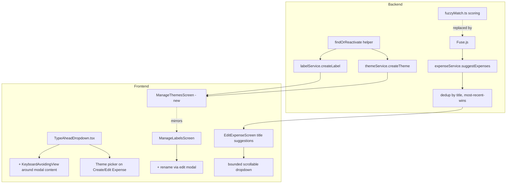

# Theme/Label UX Fixes and Autocomplete Redesign - Plan

## Goal Capsule

- **Objective:** Fix the Label/Theme disable-then-duplicate bug, build the missing Theme management screen, add expense-level Theme tagging, fix a keyboard-covering-input bug in the shared picker component, redesign the title-autocomplete suggestion list, and add lightweight discoverability (in-app help, a feature doc, auto-generated release notes).
- **Authority:** Solo-developer personal project (Navin). Requirements below come directly from a session bug report (screenshots) plus follow-up dialogue; no upstream brainstorm document exists for this batch.
- **Execution profile:** Standard code implementation — backend (Express/Prisma) and frontend (Expo/React Native) changes, one Prisma migration, one new CI step.
- **Stop conditions:** Stop and ask before deviating from the two assumption-backed defaults in Assumptions below (help-content shape, release-notes placement) if evidence during implementation makes either look wrong.

---

## Product Contract

### Summary

Fixes two real bugs (disable-then-duplicate on Label/Theme create; keyboard covering the picker search box), ships one missing screen (Manage Themes) and one missing capability (expense-level Theme tagging), redesigns the title-autocomplete suggestion UI and its underlying match-scoring algorithm, and adds three small discoverability aids (in-app help, a feature doc, EAS release notes).

### Problem Frame

The intelligence-layer features shipped in PR #55 (Themes, Labels, Categories, expense-title autocomplete) have several rough edges the owner hit during real use: Themes have no management screen at all; disabling then re-adding a Label produces a duplicate row instead of reactivating it; the Category/Label picker's search box gets covered by the Android keyboard; and the title-autocomplete suggestion list shows duplicate past entries as an expanding inline list rather than a clean dropdown. Since Label and Theme share the same backend ownership/soft-delete shape and the same frontend picker component, fixes to one class of bug apply to both without being asked twice — this is a standing rule for this codebase, not scoped to this plan alone.

### Requirements

**Backend data-integrity fixes**
- R1. Creating a Label or Theme with the same name (case-insensitive) as an existing disabled row for that user reactivates the existing row instead of inserting a duplicate. **This is the primary real-world case:** `TypeAheadDropdown`'s picker list already filters to active rows only, so a disabled item is invisible to the user — typing its name and hitting "Add new" is their only path to it, and that path must reactivate, not duplicate.
- R2. "Creating" a Label or Theme with the same name (case-insensitive) as an existing *active* row for that user returns/selects the existing row instead of inserting a duplicate. This is a defensive backend safety net, not a primary UX path — the picker's filtered list already surfaces active matches for the user to tap directly. Neither R1 nor R2 is an error the user sees; both behave identically to selecting the existing item from the list.
- R3. Every read path over Label/Theme (list, totals, suggestion pools) filters out disabled (`isActive: false`) rows — closing the same class of gap already flagged in `docs/solutions/logic-errors/group-soft-delete-leaves-expense-titles-in-autocomplete-pool.md` for `getLabelTotals`.

**Theme management**
- R4. A "Manage Themes" screen exists, listing themes with usage and a disable action, mirroring Manage Labels.
- R5. Labels gain a rename capability on the Manage Labels screen, via a small edit modal — Cancel and Save need room a row can't give them (Manage Themes already has `renameTheme`; Manage Labels currently has none).
- R6. An expense can be tagged with a Theme (not just a Group), via a Prisma migration adding `Expense.themeId` and a Theme picker on Create/Edit Expense.

**Picker and autocomplete UX**
- R7. The Category/Label/Theme picker's search input is never covered by the on-screen keyboard.
- R8. The title-autocomplete suggestion list shows at most one entry per distinct past title (the most recent), rendered as a bounded, scrollable dropdown rather than an inline list that expands the form.
- R9. The underlying match-scoring algorithm does not let a shared filler word (e.g. "to", "the") alone produce an irrelevant suggestion.

**Discoverability**
- R10. A short in-app explainer is reachable from the Label/Theme/Category fields.
- R11. `docs/FEATURES.md` lists the features this plan adds or changes (Manage Themes, Label rename, expense-level Theme tagging, the redesigned autocomplete) with a short description and a real screenshot each — not the app's full existing feature set. Audience is general (anyone who opens the repo or the app, not just the owner), so descriptions avoid internal jargon and explain what the feature does for the user, not just what changed in the code.
- R12. Every EAS build/update surfaces a short human-readable summary of what changed since the last one, written for a general reader (a tester or future user), not a raw commit-message dump.

### Scope Boundaries

- Category is **not** touched by R1-R3's reactivate-on-create fix in this plan, despite sharing the same bug shape — its create path also generates a unique `code` slug, which the shared fix would need to preserve on reactivation. Deferred to follow-up.
- No cross-group Theme aggregation/dashboard is built — Theme remains a tag, not a reporting dimension, matching the original intelligence-layer plan's stated scope.
- `renameLabel`/edit modal (R5) is a rename only, not a full label-merge or history feature.

---

## Planning Contract

### Key Technical Decisions

- **KTD1 — Shared find-or-reuse helper.** Introduce one backend helper (new `backend/src/lib/masterDataLookup.ts` or similar) implementing case-insensitive lookup + reactivate-if-disabled + return-existing-if-active, used identically by `labelService.createLabel` and `themeService.createTheme`. Neither case is an error the caller sees — "create" transparently resolves to "use the matching row," reactivating it first if needed. *(session-settled: user-directed — chosen over fixing Label alone, since the user explicitly asked for any Label fix to be checked and applied to Theme too, as a standing rule.)*
- **KTD2 — `isActive` filter audit is part of this fix, not a separate effort.** R3 extends beyond the create path because the learnings research surfaced a previously-flagged, unfixed gap (`getLabelTotals`'s `visibleLabels` query) in the same code this plan is already touching.
- **KTD3 — Keyboard fix builds on the existing modal `SafeAreaView` wrapper, does not replace it.** `TypeAheadDropdown.tsx`'s modal already has a `SafeAreaView` wrapper from issue #45 (PR #82); the keyboard fix adds its own `KeyboardAvoidingView` around that same modal content rather than restructuring it.
- **KTD4 — Fuse.js replaces the hand-rolled `fuzzyMatch.ts` scoring.** Fuse.js (v7.5.0, Apache-2.0, no known CVEs, server-side capable) implements IDF-style token weighting out of the box, which is the standard approach to R9's problem — a hand-rolled reimplementation would be strictly worse. *(session-settled: user-directed — chosen over a hand-rolled minimum-score floor, after the user asked for the industry-standard approach and it was found to already exist as a library.)*
- **KTD5 — Title-suggestion dedup happens server-side.** `expenseService.suggestExpenses` already has the ordering/date data needed to pick the most-recent match per distinct title; doing it there (not in `EditExpenseScreen.tsx`) avoids duplicating the tie-break logic on the client.
- **KTD6 — `Expense.themeId` follows the existing FK migration shape exactly.** Nullable column, `ON DELETE SET NULL ON UPDATE CASCADE`, matching `Group.themeId`/`Expense.labelId` from migration `20260905185532_add_intelligence_layer_tables`. *(session-settled: user-directed — chosen over leaving Theme group-only, after the user explicitly confirmed wanting expense-level tagging.)*
- **KTD7 — Category is explicitly out of scope for the reactivate fix.** Its create path generates a unique slug (`code`), so KTD1's helper would need adaptation, not reuse, to fit it. Not requested; deferred rather than force-fit.

### Assumptions

Two scope forks were surfaced during scoping but not explicitly confirmed by the user before proceeding; both default to the smaller-scope option. Flag if either is wrong before implementing R10/R12:

- **Help content (R10):** a small inline info popup near each field, not a link to `docs/FEATURES.md` or a separate in-app screen.
- **Release notes placement (R12):** surfaced on the EAS build/update page the owner already opens (via `eas update --message`), not a new in-app "what's new" screen.

### High-Level Technical Design



### System-Wide Impact

- **Data lifecycle (U5's migration).** `Expense.themeId` is a new nullable column with no backfill needed — existing expenses simply have `themeId = null`. `ON DELETE SET NULL` on the Theme side means disabling or deleting a theme never breaks an existing expense reference; the picker UI is the only place that needs to filter disabled themes out of new selections (per R3).
- **Read-path surface (U1's `isActive` audit).** The audit is scoped to Label and Theme read paths already touched by this plan (list, totals). It does not extend to Category, which shares the same shape but is explicitly out of scope (Scope Boundaries).
- **Shared component blast radius (U4's keyboard fix).** `TypeAheadDropdown.tsx` is used by every Category, Label, and (after U5) Theme picker across Create/Edit Expense — a correct fix here benefits all three call sites at once, but a mistake also propagates to all three.

### Risks & Dependencies

- **New dependency (U6).** `fuse.js` is a new backend dependency (Apache-2.0, v7.5.0, no known CVEs as of this research — see Sources). Mitigation: `npm audit` is part of U6's verification contract, not optional.
- **CI cannot fully gate the keyboard-fix visual baseline (U4).** The existing Maestro visual-regression pipeline has a known, still-open gap (tracked against PR #85): CI does not yet seed the fixtures some flows need, so a new baseline for this fix is advisory in CI, not a hard gate, until that closes. Local/manual verification is the real gate for U4 until then — say so explicitly in the PR rather than presenting a green CI check as full proof.
- **Prisma mock factory precedence (U5).** `backend/src/__tests__/setup.ts` centrally mocks Prisma; per `docs/solutions/test-failures/prisma-mock-factory-precedence.md`, a per-test-file `jest.mock` with no factory silently loses to it. U5's new `Expense.themeId` field/relation must be added to that central factory, not patched per-test, or tests fail with unclear "not a function" errors.

### Sources & Research

- `docs/solutions/ui-bugs/rn-modal-bottom-sheet-ignores-safe-area-android-nav-bar.md` — issue #45's fix; U4 builds on its existing `SafeAreaView` wrapper and reuses its regression-test technique (assert the modal's own wrapper, not the screen root).
- `docs/solutions/logic-errors/group-soft-delete-leaves-expense-titles-in-autocomplete-pool.md` — the previously-flagged, unfixed `isActive` filter gap that U1's R3 closes.
- `docs/solutions/test-failures/prisma-mock-factory-precedence.md` — the mock-factory gotcha U5 must account for.
- Migration `20260905185532_add_intelligence_layer_tables` — the SQL shape U5's migration follows.
- Fuse.js (v7.5.0, Apache-2.0) — [fusejs.io](https://www.fusejs.io/), confirmed no known CVEs via [Snyk](https://security.snyk.io/package/npm/fuse.js); chosen over hand-rolled IDF weighting per KTD4.

---

## Implementation Units

### U1. Backend: find-or-reactivate helper + isActive filter audit

**Goal:** Fix R1-R3 — no more duplicate rows on disable-then-recreate, and close known `isActive` filter gaps.

**Requirements:** R1, R2, R3

**Dependencies:** None

**Files:**
- `backend/src/lib/masterDataLookup.ts` (new) — shared helper
- `backend/src/services/labelService.ts` — `createLabel`, `getLabelTotals` (and any other read path missing an `isActive` filter)
- `backend/src/services/themeService.ts` — `createTheme` and its read paths
- `backend/src/__tests__/regression/` — new regression test(s)

**Approach:** Case-insensitive Prisma lookup (`mode: 'insensitive'`) scoped to the same visibility rule each service already uses (`userId: null` OR the specific user). If a matching disabled row exists, reactivate it (`isActive: true`) and return it. If a matching active row exists, return it unchanged. Only insert when no match exists at all. Neither matched case is an error — the caller (and ultimately the user) sees a normal successful "create" either way. Audit every `Label`/`Theme` read query in both services for a missing `isActive: true` filter and add it where absent.

**Patterns to follow:** `themeService.ts`'s existing `renameTheme` for the service-method shape; the ownership model, which the existing service code's own comments describe as mirroring `categoryService.ts`'s ownership model exactly (a reference to the original intelligence-layer plan's decision, not this plan's KTD7 below — the two are unrelated).

**Files (add):** `backend/src/__tests__/setup.ts` — the central Prisma mock factory's `theme`/`label` blocks currently mock only `create`/`findMany`/`findUnique`/`update`; add `findFirst` (needed by this unit's case-insensitive lookup) before writing tests, per the Prisma mock factory gotcha in Sources & Research.

**Test scenarios:**
- Creating a label/theme with a name matching a disabled row for the same user reactivates it (no new row).
- Creating a label/theme with a name matching an active row for the same user returns that existing row (no duplicate, no error, no new id).
- Creating a label/theme with a name matching another user's row (not global) still inserts a new row — ownership isolation preserved.
- Case-insensitive match: "Food" reactivates a disabled "food".
- `getLabelTotals` (and the equivalent Theme query) excludes disabled rows from its result.

**Verification:** `cd backend && npx tsc --noEmit && npm test`.

---

### U2. Backend + frontend: rename for Labels via edit modal

**Goal:** Close the R5 gap — Manage Labels has disable but no rename, unlike Manage Themes.

**Requirements:** R5

**Dependencies:** None

**Files:**
- `backend/src/services/labelService.ts` — new `updateLabel`/rename method
- `backend/src/controllers/labelController.ts`, `backend/src/schemas/labelSchema.ts` — route + validation
- `frontend/src/services/labelService.ts` — new API call
- `frontend/src/screens/ManageLabelsScreen.tsx` — Edit action opening a small rename modal
- `frontend/src/__tests__/regression/` — new regression test

**Approach:** Mirror `themeService.renameTheme`'s existing shape on the Label side. UI: tapping Edit on a row opens a small modal with a name field, Cancel, and Save — a row has no room for both buttons, so this is a modal, not inline-on-row editing. Cancel discards; Save calls the rename endpoint. A collision with a *different* active label (not the one being renamed) is blocked with an inline field error in the modal — this is not a create-time reuse case, since a rename that "succeeded silently" would merge two distinct entities and their already-tagged expenses.

**Patterns to follow:** `themeService.renameTheme` (backend); `ManageLabelsScreen.tsx`'s existing Disable button pattern (frontend); the existing create-flow modal shape (name field + actions) already used elsewhere in the picker components.

**Test scenarios:**
- Renaming a label updates its name and is reflected in `ManageLabelsScreen`.
- Renaming to a name that collides (case-insensitive) with a *different* active label for the same user is blocked with an inline field error in the modal; the original label's name is unchanged.
- Renaming a label to its own current name (case-different) is treated as a no-op success, not a collision.
- Canceling the modal discards the edit and leaves the original name unchanged.
- Renaming a label the user doesn't own is rejected (ownership check).

**Verification:** `cd backend && npm test`; `cd frontend && npx tsc --noEmit && npm test -- --run`.

---

### U3. Frontend: ManageThemesScreen

**Goal:** R4 — build the missing Theme management screen.

**Requirements:** R4

**Dependencies:** U1 (reactivate-safe create), U2 (rename-modal UI pattern to mirror)

**Files:**
- `frontend/src/screens/ManageThemesScreen.tsx` (new)
- `frontend/src/services/themeService.ts` — confirm list/disable/rename calls are exposed (some may already exist)
- Navigation registration (wherever `ManageLabelsScreen` is registered)
- `frontend/src/__tests__/regression/` — new regression test

**Approach:** Mirror `ManageLabelsScreen.tsx` structurally: list themes with usage, Disable button, rename via the same edit modal pattern from U2, applied to Theme via the existing `renameTheme`.

**Patterns to follow:** `ManageLabelsScreen.tsx` (post-U2).

**Test scenarios:**
- Screen lists active themes with their usage counts.
- Disabled themes do not appear in the list (per U1's R3 fix).
- Disable action calls the disable endpoint and removes the theme from the active list.
- Rename via the edit modal works the same as U2's Label rename.
- Empty state ("No themes yet...") matches the existing Manage Labels empty-state copy pattern.
- A failed list-load or failed Disable call is handled by whatever error pattern `ManageLabelsScreen.tsx` already uses — no new banner/retry UI introduced for this screen.

**Verification:** `cd frontend && npx tsc --noEmit && npm test -- --run`.

---

### U4. Frontend: fix keyboard covering the picker search input

**Goal:** R7 — the Category/Label/Theme picker's search box is never hidden by the keyboard.

**Requirements:** R7

**Dependencies:** None

**Files:**
- `frontend/src/components/TypeAheadDropdown.tsx`
- `frontend/src/__tests__/regression/` — new regression test
- `maestro-flows/visual/` — new flow + baseline (see verification note below)

**Approach:** Wrap the modal's existing content (already inside a `SafeAreaView` from issue #45/PR #82) in its own `KeyboardAvoidingView`, without disturbing that existing wrapper.

**Technical design:** Directional only — `<Modal><SafeAreaView><KeyboardAvoidingView>{existing content}</KeyboardAvoidingView></SafeAreaView></Modal>`, matching the nesting order already established for the safe-area fix. **Not guaranteed to work as a drop-in on Android:** `frontend/app.json` sets `edgeToEdgeEnabled: true` with no `windowSoftInputMode`/`softwareKeyboardLayoutMode` override, and `KeyboardAvoidingView` inside a `Modal` (a separate native window) is a known-unreliable combination under that config. Verify on a real Android device/emulator before trusting the wrap alone; if it no-ops, fall back to a manual `Keyboard` event listener with a measured offset instead of the automatic resize behavior.

**Patterns to follow:** `docs/solutions/ui-bugs/rn-modal-bottom-sheet-ignores-safe-area-android-nav-bar.md`'s regression-test technique — assert the *modal's own* wrapper has the behavior, not the screen root (a structural-only or screen-root-matching test would false-pass, as it did for the original safe-area fix).

**Test scenarios:**
- The modal's search input has a `KeyboardAvoidingView` ancestor that is the modal's own (not the screen root's).
- The existing `SafeAreaView` wrapper from the #45 fix is still present and unmodified in structure.
- Regression test fails against pre-fix code (red-before-green), passes after.

**Verification:** `cd frontend && npx tsc --noEmit && npm test -- --run`. New Maestro visual baseline is advisory only until CI seeds its fixtures (per the still-open gap noted in PR #85) — treat local/manual verification as the real gate for now, and say so explicitly in the PR.

---

### U5. Expense-level Theme tagging

**Goal:** R6 — an expense can be tagged with a Theme.

**Requirements:** R6

**Dependencies:** U1 (uses the reactivate-safe `createTheme`)

**Files:**
- `backend/prisma/schema.prisma` — add `themeId` to `Expense`
- `backend/prisma/migrations/<new>/migration.sql`
- `backend/src/services/expenseService.ts`, `backend/src/controllers/expenseController.ts`, `backend/src/schemas/expenseSchema.ts`
- `backend/src/__tests__/setup.ts` — add the new field/relation to the central Prisma mock factory (do not patch individual test files — this is a documented gotcha in `docs/solutions/test-failures/prisma-mock-factory-precedence.md`)
- `frontend/src/screens/CreateExpenseScreen.tsx`, `frontend/src/screens/EditExpenseScreen.tsx` — Theme picker
- `frontend/src/__tests__/regression/`, `backend/src/__tests__/regression/`

**Approach:** Migration mirrors `Group.themeId`/`Expense.labelId`'s exact shape (nullable, `ON DELETE SET NULL ON UPDATE CASCADE`, indexed). Frontend picker reuses `TypeAheadDropdown` exactly as the existing Category/Label pickers do: map themes to `{id, name}`, `onCreateNew` calls `createTheme`, push into a local `extraThemes` array so a freshly created theme shows immediately.

**Technical design:**
```
ALTER TABLE "Expense" ADD COLUMN "themeId" INTEGER;
CREATE INDEX "Expense_themeId_idx" ON "Expense"("themeId");
ALTER TABLE "Expense" ADD CONSTRAINT "Expense_themeId_fkey"
  FOREIGN KEY ("themeId") REFERENCES "Theme"("id") ON DELETE SET NULL ON UPDATE CASCADE;
```

**Patterns to follow:** `TypeAheadDropdown` usage in `EditExpenseScreen.tsx` for Category/Label; migration `20260905185532_add_intelligence_layer_tables` for SQL shape.

**Test scenarios:**
- Creating an expense with a `themeId` persists and returns it.
- Creating an expense with no theme selected leaves `themeId` null (optional field).
- Disabling a theme that's referenced by an existing expense does not break that expense (FK `SET NULL` only fires on delete, not disable — confirm disable alone leaves the reference intact).
- Deleting a theme (if that path exists) sets referencing expenses' `themeId` to null, not an error.
- Theme picker on Create/Edit Expense creates a new theme via `onCreateNew` and immediately shows it selected.
- Backend test suite passes with the new field registered in `setup.ts`'s mock factory (no "not a function" errors).

**Verification:** `cd backend && npx prisma migrate dev && npm run generate && npx tsc --noEmit && npm test`; `cd frontend && npx tsc --noEmit && npm test -- --run`.

---

### U6. Title-autocomplete redesign: Fuse.js + dedup + dropdown UI

**Goal:** R8, R9 — redesign both the scoring algorithm and the suggestion UI.

**Requirements:** R8, R9

**Dependencies:** None

**Files:**
- `backend/package.json` — add `fuse.js`
- `backend/src/lib/fuzzyMatch.ts` — replace `scoreMatch` internals with Fuse.js
- `backend/src/services/expenseService.ts` — `suggestExpenses`: dedup by title (most-recent-wins) before applying `SUGGESTION_LIMIT`
- `frontend/src/screens/EditExpenseScreen.tsx` — replace the flat inline suggestion list (~lines 382-395) with a bounded, scrollable overlay dropdown
- `backend/src/__tests__/regression/`, `frontend/src/__tests__/regression/`

**Approach:** Keep `fuzzyMatch.ts`'s pure, DB-free, unit-testable seam — Fuse.js is itself pure/DB-free, so the function signature (`query, candidates -> scored results`) can stay stable while the internals swap. Dedup logic groups matches by exact title text, keeps the entry with the most recent `expenseDate`. UI: same trigger (debounced `handleTitleChange`) and `selectSuggestedMatch` selection logic, but render inside a bounded `ScrollView`/overlay positioned under the Title field instead of an always-expanding flat `View`. No loading spinner — suggestions are a helper, not a critical operation, so while fetching or on a failed/empty result the dropdown simply doesn't appear, matching current silent behavior.

**Technical design:** The current `scoreMatch` is higher-is-better (0 = no match, 110 = exact), and `rankMatches` filters `score > 0` then sorts descending. Fuse.js's native score is the opposite (0.0 = perfect, 1.0 = no match) and has no built-in "no match" floor — by default it returns everything within its `threshold` option (default `0.6`), which will not naturally reject a filler-word-only match the way `score > 0` does today. The swap needs an explicit inversion/normalization step to preserve `rankMatches`' contract, plus a tuned `threshold` (and likely `ignoreLocation`/`minMatchCharLength`) so a single shared filler token doesn't pass. Calibrate against this app's real past expense titles, not just the illustrative test scenarios below, since Fuse's defaults are not guaranteed to demote "to"/"the" enough on their own.

**Test scenarios:**
- A query sharing only a common filler word ("to") with a candidate title scores low enough to not surface as a suggestion.
- A query matching a distinctive word scores highly and surfaces.
- Three past expenses titled "Dinner" collapse to one suggestion (the most recent).
- A genuinely different matching title still appears as a separate suggestion alongside the deduped "Dinner" entry.
- The suggestion dropdown does not expand the form's height regardless of match count (bounded/scrollable).
- Selecting a suggestion still populates the form the same way as before (no regression to `selectSuggestedMatch`).
- `npm audit` is clean after adding `fuse.js` (supply-chain check per project standards).

**Verification:** `cd backend && npm audit && npx tsc --noEmit && npm test`; `cd frontend && npx tsc --noEmit && npm test -- --run`.

---

### U7. In-app help for Label/Theme/Category

**Goal:** R10 — discoverability for the three field types.

**Requirements:** R10

**Dependencies:** None (content is more accurate once U3/U5 exist, but not blocking)

**Files:**
- Wherever Category/Label/Theme fields render (`CreateExpenseScreen.tsx`, `EditExpenseScreen.tsx`, group create/edit screens)
- A small shared info-popup component (new, if none exists)

**Approach:** Per the Assumptions section — a small inline info icon/link near each field opening a short explainer, not a link-out. Default (flag if wrong): a lightweight popover dismissed by tapping outside it or tapping the info icon again, not a modal needing its own close button. Give the info icon an accessible label (e.g. "What is a Label?") and a minimum touch target size consistent with the app's other icon buttons, matching whatever accessibility baseline the rest of the app already sets — this plan does not introduce a new accessibility standard, just applies the existing one to these new elements.

**Test scenarios:**
- Tapping the info affordance near each of Label, Theme, and Category shows distinct, accurate explanatory text.
- The info popover has an accessible label and can be dismissed by tapping outside it.
- Test expectation: mostly a content/UI-presence check, not complex logic — one test per field confirming the affordance renders, opens, and dismisses.

**Verification:** `cd frontend && npx tsc --noEmit && npm test -- --run`.

---

### U8. Auto-generated EAS release notes

**Goal:** R12 — every EAS build/update carries a short summary of what changed.

**Requirements:** R12

**Dependencies:** None

**Files:**
- `.github/workflows/eas-build.yml`

**Approach:** Generate a short summary from commit messages or merged PR titles since the last successful EAS build/update, pass it as the `eas update --message` value. Since the audience is general readers (R11), a terse or generic commit message ("fix", "wip") should not become the entire visible summary — prefer PR titles over raw commit messages where a PR exists (they're already written for a reader), and if the available source text is too sparse to be meaningful, fall back to a generic-but-honest message ("Bug fixes and improvements") rather than surfacing the raw terse text. Per the learnings research: pass commit-message-derived text through an environment variable, never interpolate `${{ github.event.head_commit.message }}` directly into a shell run step (multiline commit bodies break raw interpolation).

**Execution note:** This is CI/config work with no application runtime behavior — verify via a real triggered build/update rather than unit tests.

**Test scenarios:**
- Test expectation: none — CI config change, verified by observing a real EAS build/update's message field after merge, not by a unit test.

**Verification:** Trigger a real push touching `frontend/**`, confirm the resulting EAS update's message is a real, non-empty summary (not the raw unescaped commit message).

---

### U9. docs/FEATURES.md

**Goal:** R11 — a feature doc with real screenshots covering this plan's new/changed features. Scoped to this batch, not a full-app feature inventory; extending it to older features is a separate, unscoped effort.

**Requirements:** R11

**Dependencies:** U3, U4, U5, U6 (documents the features once they exist, so it's accurate)

**Files:**
- `docs/FEATURES.md` (new)
- Screenshot assets (new directory, e.g. `docs/screenshots/`)

**Approach:** Short, one-section-per-feature format, each description written for a reader unfamiliar with the app's internals (per R11's general audience) — what the feature does and why it's useful, not implementation detail. Capture screenshots via the existing Maestro/emulator setup already used for visual-regression baselines (`maestro-flows/visual/`), not a manual phone capture. That pipeline has a known, still-open fixture-seeding gap in CI (see U4's Risks & Dependencies note); capture these screenshots as a manual/local run against the emulator, not as a new CI-dependent step, so the doc isn't blocked by the same gap.

**Test scenarios:**
- Test expectation: none — documentation, not application behavior.

**Verification:** Manual review — every listed feature has a short, jargon-free description and a real (non-placeholder) screenshot. No CI dependency on the still-open Maestro fixture gap.

---

## Verification Contract

| Command | Applies to |
|---|---|
| `cd backend && npx tsc --noEmit` | U1, U2, U5, U6 |
| `cd backend && npm test` | U1, U2, U5, U6 |
| `cd backend && npm audit` | U6 (new dependency) |
| `cd frontend && npx tsc --noEmit` | U2, U3, U4, U5, U6, U7 |
| `cd frontend && npm test -- --run` | U2, U3, U4, U5, U6, U7 |
| `npx prisma migrate dev && npm run generate` (in `backend/`) | U5 |
| `npm run test:gate` (repo root) | All units touching `backend/src/__tests__/regression/` or `frontend/src/__tests__/regression/` |

Each fix-shaped unit (U1, U2, U4, U5's bug-adjacent parts, U6) needs a regression file under `backend/src/__tests__/regression/issue-<N>-<slug>.test.ts` or `frontend/src/__tests__/regression/issue-<N>-<slug>.test.tsx` per repo convention — file (or reference) a tracking GitHub issue per fix before naming the test file, since none of these currently have an issue number.

## Definition of Done

- All nine units implemented; `tsc --noEmit` clean on both `backend/` and `frontend/`.
- Every fix-shaped unit has a regression test that fails against pre-fix code and passes after (red-before-green), per this repo's standing rule.
- U4 additionally gets a Maestro visual flow + baseline, understood as advisory-only in CI until the fixture-seeding gap (tracked against PR #85) closes — say so explicitly in the PR rather than treating it as a hard CI gate.
- `npm audit` clean after adding `fuse.js` (U6).
- `/ce-code-review` run and findings addressed before merge, per this repo's mandatory workflow.
- No dead-end/experimental code left from approaches not taken (e.g., if Fuse.js integration is attempted a different way first).
- `/ce-compound` run after landing to capture the disable-then-duplicate bug pattern and the keyboard/modal bug class in `docs/solutions/`.
